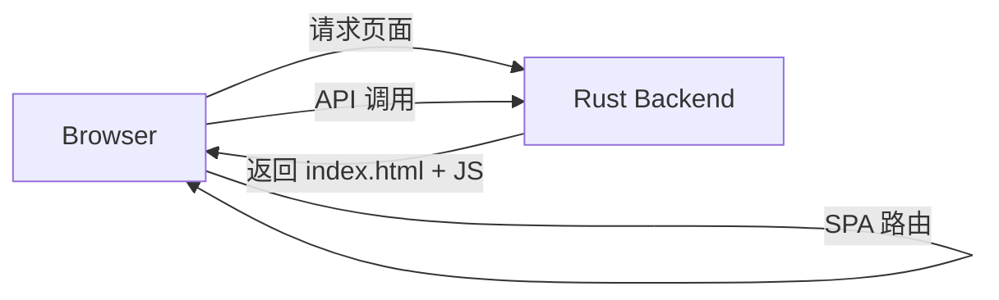
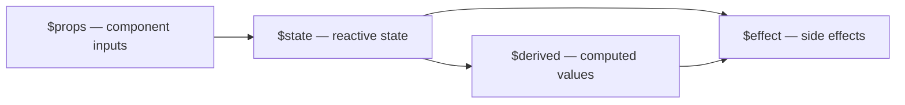

# Part 7: The SvelteKit Frontend

*Building the browser-side of FicHub — a single-page app that talks to the Rust backend we built in Parts 1–6.*

---

# Chapter 29: SvelteKit Fundamentals and SPA Mode

## From Rust to the Browser

For the last six parts of this book, we lived entirely in Rustland — building API routes, parsing fanfiction URLs, scraping chapter text, constructing EPUBs, and deploying with systemd. We set up PostgreSQL databases, wrote scraping engines for AO3 and FanFiction.net, implemented collaborative filtering for recommendations, and wired everything together with Axum routers and middleware. Our backend runs on port 8004, serves JSON over REST, and generates EPUB files on demand.

But a backend without a frontend is like a library without a reading room: all the books are there, but nobody can access them. We need a user interface — something that lets people paste a URL, click a button, and get an EPUB. Something that shows search results with pretty tag pills and word counts. Something that displays recommendations with community vote badges.

In this part of the book, we build the SvelteKit frontend that gives users a beautiful interface to FicHub. They paste a URL, click a button, and get an EPUB. They search for fics by fandom or word count. They see recommendations and vote on community suggestions. All of this happens in the browser, through a tiny API client that talks to our Rust server.

We chose SvelteKit for three reasons:

1. **Simplicity.** Svelte is famously minimal — no virtual DOM, no JSX, no complex state management libraries. Components are just HTML with some JavaScript sprinkled in. The compiler does the heavy lifting, turning your declarative components into efficient imperative DOM operations.

2. **SPA mode.** We don't need server-side rendering. Our Rust backend already serves the built files. SvelteKit can produce a pure client-side app that handles all routing in the browser — no server round-trips for navigation, no hydration mismatches, no SSR configuration headaches.

3. **Small bundle.** The compiled output is tiny — usually under 100KB of JavaScript, gzipped to under 30KB. That's dramatically smaller than a typical React or Vue bundle. Important when the app is served from the same machine running the Rust backend, and users might be on slow connections.

Let's start with the fundamentals.

## SvelteKit Review: Routes, Layouts, Pages

If you've used Next.js, Nuxt, or any other file-based routing framework, SvelteKit will feel familiar. The `src/routes/` directory is the heart of the app:

```
src/routes/
├── +layout.svelte        # Wraps every page (the app shell)
├── +layout.ts            # Shared config (SPA mode flags)
├── +page.svelte          # The root page (/)
├── [...slug]/
│   └── +page.ts          # Catch-all route (deep link support)
└── search/
    ├── +page.svelte      # The search page (/search)
    ├── +page.ts          # Search page data loader
    └── syntax/
        └── +page.svelte  # Syntax guide (/search/syntax)
```

Each `+page.svelte` file defines what the user sees at that URL. Each `+layout.svelte` wraps everything below it — think of it as a shared frame that persists across navigations. Each `+page.ts` (or `+layout.ts`) file loads data that gets passed down to the component as props.

SvelteKit uses these file conventions:

- **`+page.svelte`** — the UI for a route. Contains `<script>`, markup, and `<style>`.
- **`+page.ts`** (or `+page.js`) — the data loader for a route. Exports a `load` function that returns data passed to the component.
- **`+layout.svelte`** — shared UI that wraps child routes. The `{children}` slot contains the child page.
- **`+layout.ts`** — shared data loader and configuration. This is where we set SSR/prerender flags.
- **`[...slug]/+page.ts`** — a catch-all route that matches any path not handled by other routes.

The `+` prefix in file names is a SvelteKit convention that tells the framework "this is a special route file, not a regular component." Regular components in `src/lib/` don't have the `+` prefix — they're imported by route files.

### How Routing Works

When a user navigates to `/search?q=fluff`, SvelteKit does the following:

1. Matches the URL to `src/routes/search/+page.ts`
2. Runs the `load` function, which extracts the `q` parameter
3. Passes the data to `src/routes/search/+page.svelte` as the `data` prop
4. Renders the search page inside the layout (`+layout.svelte`)

All of this happens client-side in SPA mode. The browser never asks the server for a new HTML page — it just swaps JavaScript modules.

## SPA Mode: ssr=false, prerender=false

Here's the critical configuration that makes our frontend a single-page application. In `src/routes/+layout.ts`:

```typescript
// SPA mode: no SSR, no prerender. The backend serves the static build.
export const ssr = false;
export const prerender = false;
```

That's it. Two lines. But they fundamentally change how SvelteKit works:

**`ssr = false`** means the server never renders HTML. When a browser requests a page, the server sends a bare shell with a `<script>` tag, and the JavaScript takes over. All rendering happens client-side.

Without SSR, the initial HTML sent to the browser is just:

```html
<!DOCTYPE html>
<html>
  <head>
    <link rel="stylesheet" href="/_app/immutable/assets/0.css">
  </head>
  <body>
    <div id="app"></div>
    <script type="module" src="/_app/immutable/entry/start.js"></script>
  </body>
</html>
```

The browser downloads the JavaScript, which then renders the entire UI. The initial paint is a blank page, but the JavaScript loads fast enough that users rarely notice.

**`prerender = false`** means SvelteKit doesn't try to pre-build any pages at build time. Every route is handled dynamically by the client-side router. This is important because we don't want SvelteKit to try to crawl our pages during build — there's nothing to crawl (the content is dynamic) and the crawl would fail anyway (the backend isn't running during build).

Why would we do this? Because our architecture looks like this:

```
Browser → Rust backend (port 8004) → serves static files
                                       ↑
                                       built by SvelteKit
Browser → Rust backend (port 8004) → handles /api/v0/* requests
```

The Rust backend serves both roles: it serves the static HTML/JS/CSS files AND handles API requests at `/api/v0/*`. The browser downloads the static files, the JavaScript runs, and from then on, all navigation happens client-side — no full page reloads, no server roundtrips for navigation.



The beauty of this setup is that we get a fully static build output (just HTML, CSS, and JS files) that can be served by anything — nginx, a simple file server, or even our Rust backend's own static file handler. No Node.js runtime required in production. We built the backend in Rust for performance, and the frontend in JavaScript for the rich UI — and they communicate over a simple HTTP API.

## adapter-static: Building for Static Hosting

In `svelte.config.js`:

```javascript
import adapter from '@sveltejs/adapter-static';
import { vitePreprocess } from '@sveltejs/vite-plugin-svelte';

/** @type {import('@sveltejs/kit').Config} */
const config = {
  preprocess: vitePreprocess(),
  kit: {
    adapter: adapter({
      pages: 'build',
      assets: 'build',
      fallback: 'index.html',
      strict: false,
    }),
  },
};

export default config;
```

The `adapter-static` package is one of several SvelteKit adapters. Each adapter targets a different deployment platform:

- `adapter-static` — static files (our choice)
- `adapter-node` — Node.js server
- `adapter-vercel` — Vercel
- `adapter-netlify` — Netlify

We chose `adapter-static` because we want to serve the frontend from our Rust backend. No serverless functions, no Node runtime — just static files.

The configuration options:

- **`pages: 'build'`** — Output directory for HTML pages. When you run `npm run build`, the built files go here.
- **`assets: 'build'`** — Output directory for static assets (JS, CSS, images). Same as `pages` — everything goes in one directory.
- **`fallback: 'index.html'`** — For SPA routing: any URL that doesn't match a pre-built file gets this HTML. This is what makes client-side routing work — the server always returns the same `index.html`, and the JavaScript router figures out what to display.
- **`strict: false`** — Don't fail if some pages can't be prerendered (since we're not prerendering anything anyway). Without this, the build might warn about prerendering failures.

When you run `npm run build`, SvelteKit produces a `build/` directory containing:

```
build/
├── index.html                 # The SPA shell
├── favicon.png                # App icon
└── _app/
    └── immutable/
        ├── assets/
        │   ├── 0.css          # Global styles
        │   └── ...
        ├── chunks/
        │   ├── 0-abc123.js    # App modules
        │   └── ...
        └── entry/
            ├── start.js       # Entry point
            └── ...
```

The total output is usually under 200KB — remarkably small for a full-featured SPA. The `_app/immutable/` directory structure includes content hashes in file names (that's what `abc123` represents), enabling aggressive browser caching. When you rebuild, the hashes change, so browsers automatically fetch the new versions.

Our Rust backend then serves this directory. In Part 6, we configured the static file handler to serve everything under `build/` and fall back to `index.html` for unknown paths. The `fallback: 'index.html'` configuration in SvelteKit makes this work: when a user navigates directly to `/search?q=fluff`, nginx (or our Rust backend) returns `index.html`, and the client-side JavaScript routes them correctly.

## The +layout.ts File: Disabling SSR

We already looked at the two-line file:

```typescript
// SPA mode: no SSR, no prerender. The backend serves the static build.
export const ssr = false;
export const prerender = false;
```

But let's think about what this actually means in practice. When you define `ssr = false` in a layout, it cascades to all child routes. Every page under this layout will be rendered client-side only.

The cascade works like this: if a child route defines `export const ssr = true`, it overrides the parent layout's `ssr = false` for that specific route. So you could have SSR for specific pages (like a blog post for SEO) while keeping the rest as SPA.

But we don't need that. Our entire app is a tool for fanfiction readers — there's no SEO requirement, no social media previews we need to optimize. Pure SPA is the right call. The simplicity of two lines vs. complex SSR configuration is one of those architecture decisions that pays dividends throughout the project.

### What Happens Without These Lines

If you accidentally remove `ssr = false`, SvelteKit defaults to SSR. This means:

1. The server tries to render each page to HTML
2. The server needs access to browser APIs (`window`, `document`) — which don't exist on the server
3. Components using `$state` and `$effect` runes don't work during SSR
4. API calls to `localhost:8004` would fail during SSR (the backend isn't running during build)

The result: cryptic errors like "window is not defined" or "document is not defined." If you see these errors, check that `ssr = false` is set.

## The +page.svelte File: The Root Page

Here's something that initially confused me when I first saw it:

```svelte
<script lang="ts">
  // The root page is intentionally empty: the tabbed UI lives in +layout.svelte.
  // This page renders nothing so the layout's Download tab is the default view.
</script>
```

That's the entire root page. It's... nothing. Empty. Not even any markup.

The comment explains why: all the real UI lives in the layout. The `+layout.svelte` file defines the top bar, tab navigation, and renders the appropriate tab content (Download, Recommendations, or Suggestions) based on which tab is active. The root page exists solely to satisfy SvelteKit's routing requirements.

Why separate them? Because the layout persists across navigations. When a user clicks from the home page to `/search`, the layout stays mounted — only the `{children}` slot changes. This means the top bar, tabs, and navigation search box don't re-render. State like the active tab and search input value is preserved.

If the layout UI were in `+page.svelte` instead, navigating to `/search` would unmount the layout and mount the search page, losing all the tab state. By putting the shared UI in the layout and leaving the page empty, we get persistent navigation.

The root page is like an empty picture frame — it exists so SvelteKit has something to render at `/`, but the real content comes from the layout.

## The [...slug]/+page.ts Catch-All Route

```typescript
import type { PageLoad } from './$types';

// SPA catch-all so deep links and refresh work under adapter-static fallback.
export const load: PageLoad = async ({ url }) => {
  return { path: url.pathname };
};
```

This is the safety net. Without it, if a user refreshes the browser on a deep link like `/some/deep/path`, the `adapter-static` fallback would serve `index.html`, but SvelteKit wouldn't know how to route it. The catch-all route captures any path that hasn't been matched by a more specific route and passes it to a page component.

The `[...slug]` syntax is SvelteKit's "rest parameter" — it matches any path segments. For example:

- `/anything` matches
- `/a/b/c/d` matches
- `/search` does NOT match (because `search/+page.ts` is more specific)
- `/search/syntax` does NOT match (because `search/syntax/+page.svelte` is more specific)

The catch-all only catches what the other routes miss.

In our case, the `path` data is passed but never really used — because the layout handles all the routing. But it's there as insurance. If we ever need to handle unknown routes gracefully (maybe showing a 404 or redirecting), we can add logic to the catch-all's page component:

```svelte
<!-- Example: if we wanted a 404 page -->
<script lang="ts">
  let { data } = $props();
</script>

<div class="card">
  <h1>Page Not Found</h1>
  <p>The path <code>{data.path}</code> doesn't exist.</p>
  <a href="/">Go Home</a>
</div>
```

## File Structure Overview

Let's map out the entire frontend:

```
frontend/
├── package.json                    # Dependencies and scripts
├── svelte.config.js                # SvelteKit config with adapter-static
├── vite.config.ts                  # Vite dev server with API proxy
├── src/
│   ├── app.css                     # Global styles (CSS variables, utilities)
│   ├── lib/
│   │   ├── api/
│   │   │   ├── types.ts            # TypeScript interfaces for all API responses
│   │   │   ├── client.ts           # API client functions (fetchExport, etc.)
│   │   │   └── search.ts           # Search API types and client
│   │   ├── search/
│   │   │   └── syntax.ts           # AO3-like search syntax parser
│   │   ├── util.ts                 # Formatting helpers (formatWords, stripHtml, etc.)
│   │   └── components/
│   │       ├── DownloadTab.svelte   # Main download feature
│   │       ├── RecommendationsTab.svelte  # Recommendation engine
│   │       └── SuggestionsTab.svelte     # Community suggestions + voting
│   └── routes/
│       ├── +layout.svelte           # App shell: topbar, tabs, search
│       ├── +layout.ts               # SPA mode (ssr=false, prerender=false)
│       ├── +page.svelte             # Root page (intentionally empty)
│       ├── [...slug]+page.ts        # Catch-all for deep links
│       └── search/
│           ├── +page.svelte         # Advanced search page
│           ├── +page.ts             # Search data loader
│           └── syntax/+page.svelte  # Syntax reference guide
```

Notice how clean this is. There are no configuration files for state management (no Redux, no Zustand, no Svelte stores), no routing libraries, no API middleware. SvelteKit handles routing. Svelte's reactivity handles state. The API client is just a few functions with `fetch` calls.

The `lib/` directory is SvelteKit's convention for shared code — it's importable as `$lib/...` from any file in the project. This is where we put:

- `api/` — types and client functions for talking to the backend
- `search/` — the syntax parser
- `util.ts` — small formatting helpers
- `components/` — reusable Svelte components (the three tabs)

The `routes/` directory contains only route-specific files. The components that render at each route are either in `+page.svelte` (for simple pages) or imported from `$lib/components/` (for complex ones like the tabs).

### Why This Structure?

This organization follows the "colocation" principle — related code lives together. The API types and client are in the same directory because they're tightly coupled. The search syntax parser is separate from the search API client because it's a different concern (parsing vs. HTTP). The components live in `lib/` because they're shared across routes (the tabs are used by the layout, not by a specific route).

The `routes/` directory stays lean — it only contains files that define routes. Business logic, API clients, and utility functions live in `lib/`. This separation makes it easy to find things:

- "Where's the download feature?" → `lib/components/DownloadTab.svelte`
- "What does the API return?" → `lib/api/types.ts`
- "How does search parsing work?" → `lib/search/syntax.ts`
- "What CSS variables are available?" → `src/app.css`

Compare this to a monolithic structure where everything lives in `routes/` — you'd have to search through dozens of files to find the API types. The `lib/` directory is a clear signal: "this code is used by multiple routes."

### The `$lib` Import Alias

Every import like `$lib/api/client` maps to `src/lib/api/client`. This is a SvelteKit convention that makes imports clean and consistent:

```typescript
// Without the alias (relative paths — fragile and ugly):
import { fetchExport } from '../../lib/api/client';

// With the alias (clean and absolute):
import { fetchExport } from '$lib/api/client';
```

The `$lib` alias is always available — no configuration needed. There are other aliases too: `$app` for SvelteKit internals, `$env` for environment variables.

## Svelte 5 Runes Recap

Our codebase uses Svelte 5's runes — the new reactive primitives that replaced the old `$:` and `let` magic. If you're coming from Svelte 4, runes might feel different at first. If you're new to Svelte, runes are the only version you'll learn. Either way, they're elegant and powerful.

### `$state` — Reactive State

```typescript
let url = $state('');
let loading = $state(false);
let result = $state<ExportResponse | null>(null);
```

`$state` creates a reactive variable. When you change it, any UI that depends on it automatically updates. It's like `let` but with superpowers — the compiler tracks reads and writes and knows exactly what to re-render.

Behind the scenes, Svelte compiles `$state` into fine-grained reactivity. When `loading` changes, only the parts of the DOM that depend on `loading` are updated — not the entire component. This is why Svelte doesn't need a virtual DOM: it knows the exact DOM nodes that need to change.

You can even use `$state` for objects and arrays, and it automatically makes them deeply reactive:

```typescript
let suggestions = $state<Suggestion[]>([]);

// This triggers a re-render:
suggestions = [...suggestions, newSuggestion];

// So does this (mutating the array):
suggestions.push(newSuggestion);
```

Svelte 5 uses JavaScript Proxies to make arrays and objects deeply reactive. You don't need to learn special mutation methods (`push` instead of `concat`, `splice` instead of `filter`) like in Vue or old Svelte stores.

### `$state` for Primitive vs. Object Values

When `$state` wraps a primitive value (string, number, boolean), Svelte creates a reactive signal. When you read `loading`, you get the current value. When you write `loading = true`, subscribers are notified.

When `$state` wraps an object, it creates a Proxy that intercepts property access. This is why you can mutate objects directly:

```typescript
let user = $state({ name: 'Alice', age: 25 });

// This works and triggers reactivity:
user.name = 'Bob';

// This also works:
user = { ...user, name: 'Bob' };
```

Both patterns trigger reactivity. Use whichever is more natural for your use case.

### `$derived` — Computed Values

```typescript
let downloads = $derived.by(() => {
  if (!result) return [];
  const out: { label: string; type: string; href: string }[] = [];
  const add = (label: string, type: string, href?: string | null) => {
    if (href) out.push({ label, type, href });
  };
  add('EPUB', 'epub', result.epub_url);
  add('HTML', 'html', result.html_url);
  add('MOBI', 'mobi', result.mobi_url);
  add('PDF', 'pdf', result.pdf_url);
  return out;
});
```

`$derived` creates a value that automatically recalculates when its dependencies change. It's like a computed property — you never manually update it, you just read it. When `result` changes, `downloads` automatically recalculates.

There are two forms:

```typescript
// Simple expression:
let fullName = $derived(`${firstName} ${lastName}`);

// Complex computation (with a function body):
let downloads = $derived.by(() => {
  // ... multi-line logic
});
```

The simple form is for single expressions. The `.by()` form is for anything that needs multiple statements, conditionals, or helper functions.

### `$effect` — Side Effects

```typescript
let initialized = $state(false);

$effect(() => {
  if (data.q && !initialized) {
    initialized = true;
    queryInput = data.q;
    doSearch();
  }
});
```

`$effect` runs code whenever its reactive dependencies change. It's the replacement for `$:` reactive statements. The function you pass to `$effect` runs after the DOM updates, and Svelte automatically tracks which `$state` and `$derived` values you read inside it.

The key behaviors:

1. **Automatic dependency tracking** — Svelte records which reactive values you read inside the effect function. When any of those values change, the effect re-runs.
2. **Runs after DOM updates** — Effects run after the component has been rendered, so you can safely access DOM elements.
3. **Cleans up** — When the component is destroyed, Svelte calls the effect's cleanup function (if you return one).

The `initialized` guard is a common pattern — you want to run the effect only once (on mount), but Svelte's `$effect` re-runs whenever dependencies change. By setting `initialized = true` inside the effect, it won't run again because the condition `data.q && !initialized` becomes false.

Another pattern is using effects for URL synchronization:

```typescript
$effect(() => {
  // This runs whenever currentPage changes:
  const qs = new URLSearchParams();
  qs.set('page', String(currentPage));
  goto(`/search?${qs.toString()}`, { replaceState: true });
});
```

### `$props` — Component Inputs

```svelte
<script lang="ts">
  let { children } = $props();
  let { data } = $props();
</script>
```

`$props` replaces the old `export let` syntax for component props. It destructures the props object directly. In our layout, `children` is the special prop that represents the child route's content — Svelte injects it automatically.

The `{ children }` prop is how SvelteKit layouts work. The layout renders `{children}` in its template, and the child page's content appears there:

```svelte
<!-- +layout.svelte -->
<main class="container">
  {#if activeTab === 'download'}
    <DownloadTab />
  {:else if activeTab === 'recs'}
    <RecommendationsTab />
  {:else if activeTab === 'sugg'}
    <SuggestionsTab />
  {/if}
</main>
```

Wait — in our layout, we don't actually use `{children}`. Instead, we conditionally render the tab components directly. This is because the tabs are managed by state (not by URL routing). The `{children}` prop is available but unused in this architecture.

If we wanted the search page to appear inside the layout, we'd use `{children}` like this:

```svelte
<main class="container">
  {#if activeTab === 'download'}
    <DownloadTab />
  {:else if activeTab === 'recs'}
    <RecommendationsTab />
  {:else if activeTab === 'sugg'}
    <SuggestionsTab />
  {:else}
    {children}
  {/if}
</main>
```

### `$derived.by` — Complex Derived Values

```typescript
let sorted = $derived.by(() => {
  return [...recs].sort(
    (a, b) => b.score + b.community_score * 0.1 - (a.score + a.community_score * 0.1),
  );
});
```

When the derived computation is more than a single expression, `$derived.by()` lets you write a function body. The result of that function becomes the derived value. The `[...recs]` spread is important — it creates a copy before sorting, so we don't mutate the original array (which would break Svelte's reactivity tracking).

### Summary of Runes



These five runes — `$state`, `$derived`, `$derived.by`, `$effect`, and `$props` — are all we need. No stores, no context, no middleware. Svelte 5's runes are genuinely that powerful. The entire component state model is five keywords.

### A Note on Reactivity

Svelte's reactivity model is fundamentally different from React's. In React, changing state triggers a re-render of the entire component (and potentially child components). In Svelte, changing state triggers targeted DOM updates — only the specific text nodes, attributes, or elements that depend on the changed value are updated.

This means Svelte components are inherently more efficient. There's no reconciliation, no virtual DOM diffing, no shouldComponentUpdate. The compiler knows exactly which DOM nodes depend on which state variables, and it updates only what's necessary.

For our FicHub frontend, this means:

- Typing in the search input only updates the input value — not the entire page
- Clicking a vote button only updates the score display and button styles
- Loading results only updates the results area — the top bar and tabs stay untouched

This fine-grained reactivity is why Svelte feels fast even without optimization.

## The Vite Dev Server

One more configuration piece worth understanding is the Vite config:

```typescript
import { sveltekit } from '@sveltejs/kit/vite';
import { defineConfig } from 'vite';

export default defineConfig({
  plugins: [sveltekit()],
  resolve: {
    conditions: ['browser'],
  },
  server: {
    port: 5173,
    host: '0.0.0.0',
    proxy: {
      '/api': {
        target: 'http://localhost:8004',
        changeOrigin: true,
      },
    },
  },
  test: {
    environment: 'jsdom',
    globals: true,
    setupFiles: ['src/test-setup.ts'],
    include: ['src/**/*.test.{ts,svelte}'],
  },
});
```

The `proxy` section is clever: during development, when the SvelteKit dev server (running on port 5173) receives a request to `/api/v0/*`, it forwards it to the Rust backend (running on port 8004). This means during development, you just run `cargo run` and `npm run dev` — no need for nginx or CORS configuration.

The `changeOrigin: true` option modifies the `Host` header of the proxied request to match the target, which is important for virtual hosting setups.

The `test` section configures Vitest for unit testing:

- `environment: 'jsdom'` — simulates a browser DOM for testing Svelte components
- `globals: true` — makes `describe`, `it`, `expect` available globally
- `include: ['src/**/*.test.{ts,svelte}']` — test files live next to the code they test

In production, the Rust backend serves both the static files AND handles API requests, so there's no need for a proxy.

### The Proxy in Detail

The Vite proxy works by intercepting HTTP requests at the dev server level. When your JavaScript code calls `fetch('/api/v0/epub?q=...')`, the browser sends the request to `localhost:5173` (the Vite dev server). The proxy sees the `/api` prefix and forwards the request to `localhost:8004` (the Rust backend), then returns the response to the browser.

This is transparent to your JavaScript code — it doesn't know (or care) that the request was proxied. The code just calls `fetch('/api/v0/...')` and gets a response.

The `changeOrigin: true` option rewrites the `Host` header to match the target server. Without it, the Rust backend would see `Host: localhost:5173` instead of `Host: localhost:8004`, which could cause issues with virtual hosting or CORS.

### Package.json Scripts

```json
{
  "scripts": {
    "dev": "vite dev",
    "build": "vite build",
    "preview": "vite preview",
    "test": "vitest run",
    "test:watch": "vitest"
  }
}
```

- `npm run dev` — starts the development server with hot reload
- `npm run build` — creates the static output in `build/`
- `npm run preview` — serves the built output locally (for testing before deployment)
- `npm run test` — runs all tests once
- `npm run test:watch` — runs tests in watch mode (re-runs on file changes)

The dev dependencies include the testing stack: Vitest, Testing Library for Svelte, jest-dom matchers, and jsdom for DOM simulation. This setup gives us component testing capabilities similar to React Testing Library.

### Dependencies: Minimal by Design

Notice what's NOT in the dependencies: no state management library (Redux, Zustand, Pinia), no UI component library (Material UI, Bootstrap, Tailwind), no form library (Formik, React Hook Form), no animation library (Framer Motion), no HTTP client (Axios).

Svelte's built-in features handle all of these:

- **State management** — `$state`, `$derived`, `$effect`
- **UI components** — hand-written with scoped CSS
- **Forms** — `bind:value` with HTML validation
- **Animations** — CSS transitions and `@keyframes`
- **HTTP** — the `fetch` API (no wrapper needed)

The entire dependency list is just the build tools: SvelteKit, Vite, TypeScript, and the testing stack. This keeps the project simple, the bundle small, and the attack surface minimal.

The total dependency count is around 15 packages (including transitive dependencies). For comparison, a typical React project with state management, routing, UI library, and form handling might have 50-100+ dependencies. Fewer dependencies means fewer potential security vulnerabilities, faster installs, and less maintenance burden.

🧪 **Try It Yourself: Build the Static Output**

Run `npm run build` in the frontend directory and inspect the `build/` folder. You'll see a single `index.html` and a handful of JS/CSS files. The total size? Usually under 100KB of JavaScript — dramatically smaller than a typical React or Vue bundle. Open `build/index.html` in a browser with the Rust backend running — it should work identically to `npm run dev`.

⚠️ **Watch Out: Don't Accidentally Server-Render**

If you remove `export const ssr = false` from `+layout.ts`, the pages will try to server-render, and since we have no SSR setup (no database connections, no API calls during SSR), you'll get hydration mismatches or "window is not defined" errors. Always keep that line unless you have a specific reason to enable SSR for a route.

⚠️ **Watch Out: The Proxy Is Development-Only**

The Vite proxy in `vite.config.ts` only works during `npm run dev`. The built output (from `npm run build`) doesn't include the proxy — it's just static files. In production, nginx or the Rust backend handles the `/api` routing. Don't confuse development behavior with production behavior.

---

# Chapter 30: The API Client and TypeScript Types

## Why an API Client?

Picture this: you're building a Svelte component that needs to download a fanfiction. You could write this directly in the component:

```svelte
<script>
  async function handleDownload() {
    const res = await fetch(`/api/v0/epub?q=${encodeURIComponent(url)}`);
    const data = await res.json();
    // ... use data somehow
  }
</script>
```

But this has problems:

1. **No type safety.** What does `data` look like? What properties does it have? TypeScript can't help you. You'll find out about missing properties at runtime — in the browser console, in front of users.

2. **Repeated error handling.** Every component needs to handle network errors, API errors, and JSON parsing errors the same way. Copy-pasting error handling across five components is a bug factory.

3. **Hardcoded URLs.** If the API path changes from `/api/v0/epub` to `/api/v1/epub`, you'd need to update every component. Miss one, and that feature silently breaks.

4. **No reusability.** If two components need the same API call, you'd duplicate the fetch logic in both.

An API client solves all four problems. It's a centralized module that:

- Defines TypeScript types for every API response
- Handles HTTP requests, errors, and JSON parsing
- Provides named functions for each API endpoint
- Returns fully typed data

Think of it as a translator between the UI and the server. The UI says "I want to download this fic," and the API client says "I'll handle the HTTP details, error handling, and type conversion. Here's your typed response."

## types.ts: The Type Dictionary

Let's walk through `src/lib/api/types.ts` — the file that defines the shape of every API response. This is the contract between the frontend and the Rust backend. Every type here corresponds to a struct or enum in the Rust code.

### ExportUrls

```typescript
/** A single export's download URLs (keys: epub, html, mobi, pdf). */
export interface ExportUrls {
  epub?: string;
  html?: string;
  mobi?: string;
  pdf?: string;
}
```

Each property is optional (`?`) because not every fic is available in every format. The Rust backend only returns URLs for formats it successfully generated. If the EPUB conversion failed but HTML succeeded, you'd get `{ html: "/cache/html/123?h=abc" }` — no `epub` property at all.

### FicMeta

```typescript
/** Fic metadata object returned by /api/v0/epub and /api/v0/meta. */
export interface FicMeta {
  id: string;
  title: string;
  author: string;
  chapters: number;
  words: number;
  description: string;
  status: string;
  source: string;
  created: string;
  updated: string;
  extra_meta: unknown | null;
  raw_extended_meta: unknown | null;
  author_url: string;
  author_local_id: string;
  source_id: number;
  author_id: number;
}
```

This mirrors the `FicMeta` struct in our Rust code. The TypeScript interface ensures that whenever the API returns metadata, every component knows exactly what fields are available.

Let's look at each field:

- `id` — the URL ID (a hash of the source URL, used as a unique identifier)
- `title`, `author` — basic fic info scraped from the source site
- `chapters`, `words` — numeric stats
- `description` — the fic's summary, may contain HTML
- `status` — "Complete", "In Progress", "Abandoned", etc.
- `source` — the original URL or source identifier
- `created`, `updated` — ISO 8601 timestamps
- `extra_meta`, `raw_extended_meta` — site-specific metadata (e.g., kudos, hits, bookmarks for AO3 fics). These are `unknown | null` because they can be anything depending on the source site.
- `author_url`, `author_local_id` — author identification
- `source_id`, `author_id` — numeric IDs for database relationships

The `unknown | null` types for the metadata fields reflect that these can be anything (or nothing) depending on the source site. AO3 fics might have `{ kudos: 1500, hits: 50000 }`, while FanFiction.net fics might have `{ favorites: 200, alerts: 100 }`.

### ExportResponse

```typescript
/** Response from GET /api/v0/epub?q=<url> and GET /api/v0/meta?q=<url>. */
export interface ExportResponse {
  err: number;
  q?: string;
  msg?: string;
  fixits?: unknown[];
  info?: string;
  url_id?: string;
  slug?: string;
  meta?: FicMeta;
  hashes?: Record<string, string>;
  urls?: ExportUrls;
  epub_url?: string | null;
  html_url?: string | null;
  mobi_url?: string | null;
  pdf_url?: string | null;
  notes?: string[];
}
```

This is the main response type for our primary feature — downloading fics. Let's break down the fields:

- `err` — numeric error code. 0 means success. Non-zero means something went wrong.
- `q` — the original query (URL) echoed back
- `msg` — error message (when `err !== 0`)
- `fixits` — suggestions for fixing broken URLs (when the backend can detect what went wrong)
- `info` — informational message
- `url_id` — the resolved URL ID
- `slug` — URL-safe slug for the fic
- `meta` — the fic metadata (when successful)
- `hashes` — content hashes for cache-busting
- `urls` — download URLs object
- `epub_url`, `html_url`, `mobi_url`, `pdf_url` — convenience URLs for direct download
- `notes` — array of notes (e.g., "This fic has been updated since your last download")

The individual `epub_url`, `html_url` etc. fields at the top level are convenience URLs for direct download. The `urls` object and `hashes` are for the cache route (which we built in Part 5).

### Recommendation Types

```typescript
/** A single recommendation returned by GET /api/v0/recommendations. */
export interface RecResult {
  url_id: string;
  title: string;
  author: string;
  words: number;
  chapters: number;
  status: string;
  site_domain: string;
  summary: string;
  score: number;
  community_score: number;
  download_urls: Record<string, string>;
}
```

Each recommendation includes both an algorithmic `score` (from the collaborative filtering engine we built in Part 4) and a `community_score` (from user votes). The `download_urls` field lets users directly download any recommended fic without leaving the recommendations page.

```typescript
/** Response from GET /api/v0/recommendations. */
export interface RecommendationsResponse {
  err: number;
  url_id: string;
  site_domain?: string | null;
  recommendations: RecResult[];
  generated_at: string;
}
```

The `generated_at` timestamp tells the frontend when the recommendations were computed. This is useful for showing "Recommendations generated 2 hours ago" — letting users know the data might be stale.

### Suggestion and Vote Types

```typescript
/** A community suggestion returned by GET /api/v0/recommendations/votes. */
export interface Suggestion {
  id: number;
  suggested_url_id: string;
  comment: string | null;
  net_votes: number;
  created: string | null;
}
```

Each suggestion is a user-submitted recommendation with a URL and optional comment. The `net_votes` is the current vote count (upvotes minus downvotes).

```typescript
/** Response from POST /api/v0/recommendations/suggest. */
export interface SuggestResponse {
  err: number;
  suggestion_id?: number;
  msg?: string;
}
```

```typescript
/** Response from POST /api/v0/recommendations/vote. */
export interface VoteResponse {
  err: number;
  new_score: number;
}
```

The `VoteResponse` returns the updated score after a vote. This lets the UI update the displayed score without re-fetching all suggestions.

Every type maps directly to what the Rust backend returns. This 1:1 correspondence is intentional — it makes debugging easy. If the TypeScript type says something exists but it's `undefined` in the browser, the backend probably isn't returning it. Check the Rust handler's `serde::Serialize` derive.

## client.ts: The HTTP Layer

Now let's look at the actual API client functions that make requests to the Rust backend.

### The ApiError Class

```typescript
class ApiError extends Error {
  status: number;
  body: string;
  constructor(status: number, body: string) {
    super(`API error ${status}: ${body}`);
    this.name = 'ApiError';
    this.status = status;
    this.body = body;
  }
}
```

The `ApiError` class extends the standard `Error` with HTTP-specific details. This lets us catch errors and still know what happened:

```typescript
try {
  await fetchExport(url);
} catch (e) {
  if (e instanceof ApiError) {
    // We know the status code and response body
    error = `Server returned ${e.status}. Is the backend running?`;
  } else {
    error = 'Network error.';
  }
}
```

Setting `this.name = 'ApiError'` ensures the error name in stack traces shows `ApiError` instead of `Error`, making debugging easier.

### The request() Helper

```typescript
async function request<T>(path: string, init?: RequestInit): Promise<T> {
  const res = await fetch(`${BASE}${path}`, init);
  if (!res.ok) {
    const text = await res.text().catch(() => '');
    throw new ApiError(res.status, text);
  }
  return (await res.json()) as T;
}
```

This is the foundation of every API call. It's beautifully simple:

1. **Prepend the base URL** — `BASE` is `/api/v0`, so `request('/epub?q=...')` fetches `/api/v0/epub?q=...`
2. **Make the fetch request** — pass through any additional options (method, headers, body)
3. **Check for errors** — `res.ok` is true for status 200-299. If not, read the error text and throw an `ApiError`
4. **Parse and return** — `res.json()` parses the JSON body, cast to type `T`

The `<T>` generic parameter is what gives us type safety. When we call `request<ExportResponse>('/epub?q=...')`, TypeScript knows the return type is `ExportResponse`. Every function that uses `request()` inherits this type safety.

The `.catch(() => '')` after `res.text()` handles the edge case where the server returns a non-JSON error response that can't be read as text (e.g., a binary error page).

### The buildQuery() Helper

```typescript
function buildQuery(params: Record<string, string | number | undefined>): string {
  const entries = Object.entries(params).filter(
    ([, v]) => v !== undefined && v !== null && v !== '',
  );
  if (entries.length === 0) return '';
  const qs = entries
    .map(([k, v]) => `${encodeURIComponent(k)}=${encodeURIComponent(String(v))}`)
    .join('&');
  return `?${qs}`;
}
```

It filters out `undefined`, `null`, and empty string values — so we only include parameters that are actually set. This keeps URLs clean.

For example:

```typescript
buildQuery({ q: 'hello', n: 20, url_id: undefined })
// Returns: "?q=hello&n=20"
// Note: url_id is excluded because it's undefined
```

The `encodeURIComponent` ensures special characters in values (like `&`, `=`, `?`) are properly escaped.

### Why Not Use URLSearchParams?

We could use `URLSearchParams` for building query strings (like `buildSearchQuery()` does). But `buildQuery()` in `client.ts` was written earlier and follows a different pattern — it takes a plain object and returns a string. `URLSearchParams` is more modern and handles edge cases better, but both approaches work. The inconsistency between `client.ts` and `search.ts` is a minor technical debt — in a perfect world, we'd use `URLSearchParams` everywhere.

### fetchExport()

```typescript
/** GET /api/v0/epub?q=<url> — export a fic and return download URLs. */
export async function fetchExport(url: string): Promise<ExportResponse> {
  return request<ExportResponse>(`/epub${buildQuery({ q: url })}`);
}
```

One line. The entire download flow is: take a URL, build a query string, make a GET request, return typed data. All the complexity (scraping, EPUB generation, caching) happens on the Rust backend.

The function signature tells you everything: it takes a string (the fic URL), and returns a Promise that resolves to an `ExportResponse`. No ambiguity about what goes in or what comes out.

### Error Handling Philosophy

Notice the error handling pattern throughout the API client: we don't catch errors inside the client functions. The `request()` helper throws `ApiError` for HTTP errors, and individual functions let those errors propagate to the caller.

This is intentional. The API client is a "thin" layer — it handles HTTP mechanics (headers, status codes, JSON parsing) but leaves error handling to the UI components. Each component can decide how to display errors based on context:

- The download tab shows a red card with supported sites
- The recommendations tab shows a simpler error message
- The suggestions tab shows errors inline in the modal

If the API client caught errors internally, it would need to know about UI concerns (what message to show, where to display it). By letting errors propagate, we keep the client focused on its job: making HTTP requests and returning typed data.

The only exception is the `ApiError` class — it wraps HTTP errors with structured data (status code, response body) so callers can make informed decisions about how to handle them.

### fetchMeta()

```typescript
/** GET /api/v0/meta?q=<url> — fetch fic metadata without downloading. */
export async function fetchMeta(url: string): Promise<ExportResponse> {
  return request<ExportResponse>(`/meta${buildQuery({ q: url })}`);
}
```

Same shape as `fetchExport()` but hits the `/meta` endpoint. This is for getting metadata without actually generating download files — useful for previews or quick lookups. Note that it returns `ExportResponse` (not a separate `MetaResponse`) because the backend uses the same response type for both endpoints.

### fetchRecommendations()

```typescript
/** GET /api/v0/recommendations?q=<url>&n=<n> — get recommendations for a fic. */
export async function fetchRecommendations(
  q?: string,
  url_id?: string,
  n = 20,
): Promise<RecommendationsResponse> {
  return request<RecommendationsResponse>(
    `/recommendations${buildQuery({ q, url_id, n })}`,
  );
}
```

This is interesting because it accepts either a URL (`q`) or a pre-resolved `url_id`. The backend can resolve either one. If you already know the `url_id` (from a previous call), you can pass it directly to skip the URL resolution step.

The `n` parameter defaults to 20 — the number of recommendations to return. The backend's collaborative filtering engine computes scores for all known fics and returns the top `n`.

### fetchVotes()

```typescript
/** GET /api/v0/recommendations/votes?url_id=<id> — list community votes. */
export async function fetchVotes(url_id: string): Promise<VotesResponse> {
  return request<VotesResponse>(`/recommendations/votes${buildQuery({ url_id })}`);
}
```

Fetches community suggestions for a given fic (identified by `url_id`). Returns an array of `Suggestion` objects, each with its current vote count.

### submitSuggestion()

```typescript
/** POST /api/v0/recommendations/suggest — submit a recommendation suggestion. */
export async function submitSuggestion(
  url_id: string,
  suggested_url: string,
  comment?: string,
): Promise<SuggestResponse> {
  return request<SuggestResponse>('/recommendations/suggest', {
    method: 'POST',
    headers: { 'Content-Type': 'application/json' },
    body: JSON.stringify({ url_id, suggested_url, comment }),
  });
}
```

This is the first POST request in our client. The rest have been GETs. It sends a JSON body with the suggestion details. The `comment` is optional — users can suggest a fic without explaining why.

The `request()` helper passes through the `init` parameter (method, headers, body) to `fetch()`, making it flexible enough for both GET and POST requests.

### castVote()

```typescript
/** POST /api/v0/recommendations/vote — upvote (1) or downvote (-1) a suggestion. */
export async function castVote(suggestion_id: number, vote: 1 | -1): Promise<VoteResponse> {
  return request<VoteResponse>('/recommendations/vote', {
    method: 'POST',
    headers: { 'Content-Type': 'application/json' },
    body: JSON.stringify({ suggestion_id, vote }),
  });
}
```

The `vote` parameter is typed as `1 | -1` — a union type that prevents bugs like accidentally passing `0` or `2`. TypeScript enforces this at compile time. If you try `castVote(42, 0)`, the compiler will flag an error.

The response includes `new_score` — the updated vote count after the vote is applied. This lets the UI update the displayed score immediately.

### Exporting the API

```typescript
export { ApiError };
```

The `ApiError` class is exported so components can use `instanceof` checks in catch blocks. The individual functions (`fetchExport`, `fetchMeta`, etc.) are exported where they're defined.

## search.ts: The Search API

The search module is more complex because it handles multiple filter types and includes constants for dropdown options.

### The Import Structure

Looking at the imports across the codebase, there's a clear pattern:

```typescript
// In components:
import { fetchExport, ApiError } from '$lib/api/client';
import type { ExportResponse } from '$lib/api/types';
import { formatWords, detectSite, stripHtml } from '$lib/util';

// In the search page:
import { search } from '$lib/api/search';
import type { SearchFilters, SearchResult, SearchResponse } from '$lib/api/search';
import { SORT_OPTIONS, COMPLETE_OPTIONS, SOURCE_OPTIONS, defaultFilters } from '$lib/api/search';
import { parseSearchQuery } from '$lib/search/syntax';
```

The pattern is: API functions from `client.ts`, types imported as `type` (type-only imports erased at compile time), constants from the module that defines them, and utility functions from `util.ts`.

Type-only imports (`import type { ... }`) are important for bundle size. They tell the compiler "I only need this for type checking — don't include it in the JavaScript output." Without `type`, the import might cause the module to be included in the bundle even if only the type is used.

### SearchFilters

```typescript
export interface SearchFilters {
  q: string;
  include_tags: string;
  exclude_tags: string;
  include_any_tags: string;
  min_words: number | null;
  max_words: number | null;
  min_chapters: number | null;
  max_chapters: number | null;
  complete: boolean | null;
  source: string;
  date_from: string;
  date_to: string;
  sort: string;
  page: number;
  per_page: number;
}
```

This covers every filter the search API supports. The `null` values mean "no filter applied" — different from an empty string, which might mean something different depending on the field.

### How Filters Map to URL Parameters

Each filter corresponds to a URL parameter that the Rust backend accepts:

```
q              → ?q=fandom:Harry+Potter
include_tags   → ?include_tags=1:Harry+Potter,4:Fluff
exclude_tags   → ?exclude_tags=1:Naruto
min_words      → ?min_words=10000
max_words      → ?max_words=50000
complete       → ?complete=true
source         → ?source=archiveofourown.org
date_from      → ?date_from=2024-01-01T00:00:00Z
sort           → ?sort=updated
page           → ?page=2
```

The `buildSearchQuery()` function handles this mapping — it's the bridge between the typed filter object and the URL string the backend expects.

### The Tag Format

Tags use `typeId:name` format separated by commas, mapping directly to our database:

```
1:Harry Potter  → Fandom (type_id = 1)
4:Fluff         → Freeform (type_id = 4)
1:Harry Potter,4:Fluff  → Multiple tags
```

For example, `source: ''` means "all sites" (no filter), while `source: 'archiveofourown.org'` means "AO3 only." The `null` values for numeric fields (`min_words`, etc.) mean the backend applies no constraint.

### buildSearchQuery()

```typescript
export function buildSearchQuery(filters: SearchFilters): string {
  const params = new URLSearchParams();

  if (filters.q) params.set('q', filters.q);
  if (filters.include_tags) params.set('include_tags', filters.include_tags);
  if (filters.exclude_tags) params.set('exclude_tags', filters.exclude_tags);
  if (filters.include_any_tags) params.set('include_any_tags', filters.include_any_tags);
  if (filters.min_words !== null) params.set('min_words', String(filters.min_words));
  if (filters.max_words !== null) params.set('max_words', String(filters.max_words));
  if (filters.min_chapters !== null) params.set('min_chapters', String(filters.min_chapters));
  if (filters.max_chapters !== null) params.set('max_chapters', String(filters.max_chapters));
  if (filters.complete !== null) params.set('complete', String(filters.complete));
  if (filters.source) params.set('source', filters.source);
  if (filters.date_from) params.set('date_from', filters.date_from);
  if (filters.date_to) params.set('date_to', filters.date_to);
  if (filters.sort) params.set('sort', filters.sort);
  if (filters.page > 1) params.set('page', String(filters.page));
  if (filters.per_page !== 20) params.set('per_page', String(filters.per_page));

  return params.toString();
}
```

Two smart defaults: `page` is only included if it's greater than 1, and `per_page` is only included if it's not the default of 20. This keeps the URL clean for the most common case (first page, default results per page).

The `URLSearchParams` class handles URL encoding automatically, which is why we don't need manual `encodeURIComponent` calls here.

### The search() Function

```typescript
export async function search(filters: SearchFilters): Promise<SearchResponse> {
  const qs = buildSearchQuery(filters);
  const res = await fetch(`/api/v0/search${qs ? '?' + qs : ''}`);
  if (!res.ok) {
    const text = await res.text().catch(() => '');
    throw new Error(`Search failed (${res.status}): ${text}`);
  }
  return (await res.json()) as SearchResponse;
}
```

Note that this function doesn't use the `request()` helper from `client.ts`. It uses raw `fetch` directly. This is because the search module was added later and follows slightly different patterns. In a perfect world, we'd unify them — but in a real project, getting things working often takes priority over architectural purity.

The `SearchResponse` type:

### Why the Search Module Is Separate

The search functionality could have been part of `client.ts`, but it's separated for a reason: the search system has its own types, constants, and helper functions that are specific to search. Putting them in `client.ts` would make that file much larger and harder to navigate.

By separating search into its own module, we get:

1. **Focused imports** — `import { search, SearchFilters } from '$lib/api/search'` instead of a long import from a monolithic client
2. **Independent evolution** — the search API might change format (different filters, pagination) without affecting the core client
3. **Testability** — the search module can be tested independently
4. **Discoverability** — searching for "search" in the file system finds the right module immediately

This is the "single responsibility principle" applied to file organization: each module does one thing well.

```typescript
export interface SearchResponse {
  total: number;
  page: number;
  per_page: number;
  results: SearchResult[];
}
```

Each `SearchResult` includes rich data:

```typescript
export interface SearchResult {
  url_id: string;
  title: string;
  author: string;
  source: string;
  words: number;
  chapters: number;
  status: string;
  description: string;
  updated: string | null;
  rank: number | null;
  tags: SearchTag[];
  total_freeform: number;
}
```

The `tags` array contains the fic's tags with their types and relevance scores:

```typescript
export interface SearchTag {
  name: string;
  type: string;
  type_id: number;
  score: number;
}
```

### Sort and Filter Constants

```typescript
export const TAG_TYPES = {
  1: 'Fandom',
  2: 'Character',
  3: 'Relationship',
  4: 'Freeform',
} as const;

export const SORT_OPTIONS = [
  { value: '', label: 'Relevance' },
  { value: 'updated', label: 'Date Updated' },
  { value: 'created', label: 'Date Published' },
  { value: 'words', label: 'Word Count' },
  { value: 'kudos', label: 'Kudos' },
] as const;

export const COMPLETE_OPTIONS = [
  { value: '', label: 'All Works' },
  { value: 'true', label: 'Complete Only' },
  { value: 'false', label: 'In Progress Only' },
] as const;

export const SOURCE_OPTIONS = [
  { value: '', label: 'All Sites' },
  { value: 'archiveofourown.org', label: 'Archive of Our Own' },
  { value: 'fanfiction.net', label: 'FanFiction.net' },
  { value: 'fictionpress.com', label: 'FictionPress' },
  { value: 'forums.spacebattles.com', label: 'SpaceBattles' },
  { value: 'forums.sufficientvelocity.com', label: 'SufficientVelocity' },
] as const;
```

These are used by the dropdown selects on the search page. The `as const` assertion tells TypeScript these arrays are readonly and their types are the exact literal values — not just `string`. This means TypeScript knows that `SORT_OPTIONS[0].value` is `''` (the empty string literal), not just `string`.

The `TAG_TYPES` constant maps numeric type IDs (from the database) to human-readable names. This is used in the search results to show tag types on hover.

### defaultFilters()

```typescript
export function defaultFilters(): SearchFilters {
  return {
    q: '',
    include_tags: '',
    exclude_tags: '',
    include_any_tags: '',
    min_words: null,
    max_words: null,
    min_chapters: null,
    max_chapters: null,
    complete: null,
    source: '',
    date_from: '',
    date_to: '',
    sort: '',
    page: 1,
    per_page: 20,
  };
}
```

A factory function that creates a fresh `SearchFilters` object with all fields at their default (empty/null) values. This is used to reset filters and as the initial state for the search page.

## util.ts: Formatting Helpers

The utility module contains small functions shared across components. Each one is pure (no side effects) and focused on a single formatting task.

### formatWords()

```typescript
export function formatWords(words: number): string {
  return words.toLocaleString('en-US');
}
// formatWords(1234567) → "1,234,567"
// formatWords(42) → "42"
// formatWords(1000000) → "1,000,000"
```

Converts large numbers into readable strings with commas. This is used everywhere — in search results, recommendation cards, and the download tab. "1,234,567 words" is much more readable than "1234567 words."

### detectSite()

```typescript
export function detectSite(url: string): string {
  if (url.includes('archiveofourown.org')) return 'AO3';
  if (url.includes('fanfiction.net')) return 'FanFiction.net';
  if (url.includes('fictionpress.com')) return 'FictionPress';
  if (url.includes('xenforo') || url.includes('spacebattles') || url.includes('sufficientvelocity'))
    return 'Forum';
  return 'Unknown';
}
```

Detects the fanfiction site from a URL. The function checks for known domain patterns and returns a human-readable name. The "Forum" category covers XenForo-based sites like SpaceBattles and SufficientVelocity — they share the same underlying software.

The detection is simple string matching, not URL parsing. It's fast and works for all our supported sites. If a URL doesn't match any known pattern, it returns "Unknown."

### stripHtml()

```typescript
export function stripHtml(html: string): string {
  if (!html) return '';
  return html
    .replace(/<br\s*\/?>/gi, ' ')        // <br> → space
    .replace(/<\/(p|div)>/gi, ' ')        // </p> </div> → space
    .replace(/<[^>]+>/g, '')              // all other tags → nothing
    .replace(/&amp;/g, '&')              // HTML entities
    .replace(/&lt;/g, '<')
    .replace(/&gt;/g, '>')
    .replace(/&quot;/g, '"')
    .replace(/&#39;/g, "'")
    .replace(/\s+/g, ' ')               // collapse whitespace
    .trim();
}
```

Fanfiction summaries come from the source sites with HTML markup — paragraphs, line breaks, italics, links. We need plain text for display in our UI. The regex chain handles:

1. **Line breaks** — `<br>` becomes a space (preserving word separation)
2. **Block elements** — `</p>` and `</div>` become spaces
3. **All other tags** — stripped entirely
4. **HTML entities** — converted to their actual characters
5. **Whitespace** — collapsed to single spaces
6. **Leading/trailing whitespace** — trimmed

This is a pragmatic approach. It doesn't handle every HTML edge case (like nested tags or malformed HTML), but it works well for fanfiction summaries. A more robust solution would use a DOM parser like `DOMParser`, but that would be overkill for this use case.

### Why Not Use a DOM Parser?

We could use `new DOMParser().parseFromString(html, 'text/html').textContent` to strip HTML. This would handle every edge case correctly. But it's slower (creates a DOM tree), requires a browser environment (won't work in Node.js tests), and adds complexity.

For fanfiction summaries, the regex approach works because:
- Summaries are short (usually under 1000 characters)
- They use simple HTML (paragraphs, line breaks, bold, italic)
- They don't contain complex structures (tables, forms, embedded content)

The regex chain handles the 95% case correctly. The remaining 5% (malformed HTML, unusual tags) might produce slightly messy text, but it's still readable.

### relativeTime()

```typescript
export function relativeTime(iso: string): string {
  if (!iso) return '';
  const then = new Date(iso).getTime();
  if (isNaN(then)) return '';
  const diff = Date.now() - then;
  const sec = Math.floor(diff / 1000);
  if (sec < 60) return 'less than a minute ago';
  const min = Math.floor(sec / 60);
  if (min < 60) return `${min} minute${min > 1 ? 's' : ''} ago`;
  const hr = Math.floor(min / 60);
  if (hr < 24) return `${hr} hour${hr > 1 ? 's' : ''} ago`;
  const day = Math.floor(hr / 24);
  return `${day} day${day > 1 ? 's' : ''} ago`;
}
```

Converts ISO timestamps like `"2024-06-15T10:30:00Z"` into friendly strings like "3 days ago." The function handles edge cases:

- Empty string → returns empty string
- Invalid date → returns empty string
- Very recent → "less than a minute ago"
- Singular/plural → "1 minute" vs "2 minutes"

The granularity stops at days — for older fics, "30 days ago" is fine. We don't need "1 month ago" or "1 year ago" for this use case.

### Why Not Use Intl.RelativeTimeFormat?

JavaScript has a built-in `Intl.RelativeTimeFormat` that handles relative time formatting with proper pluralization and localization. We could use it:

```javascript
const rtf = new Intl.RelativeTimeFormat('en', { numeric: 'auto' });
rtf.format(-3, 'day'); // "3 days ago"
```

But we didn't, for two reasons:

1. **Bundle size** — the custom function is 15 lines. `Intl.RelativeTimeFormat` is a large API that might not be tree-shaken.
2. **Control** — our function gives us exact control over the output format. We can stop at days, skip hours, or add custom formatting.

For a fanfiction app serving English-speaking users, the custom function is the right choice.

### cacheUrl()

```typescript
export function buildDownloadUrl(etype: string, urlId: string, hash: string): string {
  return `/cache/${etype}/${urlId}?h=${hash}`;
}
```

Builds URLs for our cache route — the one we set up in Part 5 to serve cached EPUB/HTML files with proper content types and cache headers. The `h` parameter is the content hash, used for cache validation.

### Why Cache URLs?

The cache route (`/cache/epub/{url_id}?h={hash}`) serves two purposes:

1. **Content-type headers** — the Rust backend sets `Content-Type: application/epub+zip` for EPUBs, `text/html` for HTML, etc. Without this, browsers might try to display EPUB files as text.

2. **Cache headers** — the `h` parameter is a content hash. If the hash matches, the backend returns `304 Not Modified` (no body). If the hash is stale, the backend regenerates and returns the new file with a fresh hash.

This means the first download is slow (generation), but subsequent downloads of the same fic are instant (cache hit). The hash ensures users always get the latest version.

## Type Safety in Practice

The beauty of all this typing shows up in the components. When a component calls `fetchExport(url)`, TypeScript knows the response is an `ExportResponse`. When it accesses `result.meta`, it knows that's a `FicMeta` with `title`, `author`, `words`, etc. If you try to access `result.meta.titleSize`, TypeScript will flag an error before you ever run the code.

This isn't just nice to have — it catches entire categories of bugs:

- **Typos in property names** — caught at compile time (`result.titel` instead of `result.title`)
- **Missing null checks** — caught at compile time (`result.meta.title` when `meta` is optional)
- **Wrong argument types** — caught at compile time (`fetchExport(42)` when it expects a string)
- **Wrong return types** — caught at compile time (assigning an `ExportResponse` to a `RecResult` variable)

In a project where the frontend and backend are developed separately (Rust in one language, TypeScript in another), having strong types on both sides is invaluable. If the backend changes its response shape, you update the TypeScript types, and every component that uses the wrong field gets a compile error.

The types also serve as documentation. When you open `types.ts`, you immediately understand what the API returns. No need to check the Rust code, no need to read the Axum handlers, no need to run the server and inspect responses. The types tell the story.

🧪 **Try It Yourself: Explore the Types**

Open `src/lib/api/types.ts` and try modifying a type — say, rename `epub_url` to `epubLink`. Save the file. The TypeScript compiler will immediately flag every component that references `result.epub_url` — showing you exactly where the old name is used. This is the kind of safety net that pays for itself instantly.

Try adding a new field to `FicMeta` — say, `rating: string`. Then go to `DownloadTab.svelte` and add `{m.rating}` to the template. TypeScript will happily accept it because the type already includes the field.

⚠️ **Watch Out: `unknown` vs `any`**

Notice the use of `unknown` instead of `any` in the types:

```typescript
extra_meta: unknown | null;
raw_extended_meta: unknown | null;
fixits?: unknown[];
```

TypeScript's `unknown` is the safe version of `any`. While `any` lets you do anything (access any property, call any method), `unknown` forces you to check the type before using it. This prevents accidental runtime errors — you can't accidentally call `.toString()` on an `unknown` value without first checking that it's actually a string.

Always prefer `unknown` when you genuinely don't know the shape of data. Reserve `any` for truly dynamic situations (like third-party library integrations with poor type definitions).

---

# Chapter 31: Download, Recommendations, Suggestions Tabs

## The Three Tabs of FicHub

The main interface is a tabbed layout. Three tabs, three features:

1. **Download** — paste a URL, get an EPUB
2. **Recommendations** — paste a URL, discover similar fics
3. **Suggestions** — see what the community recommends, vote on suggestions

Each tab is a self-contained Svelte component. They share the same layout (top bar, tab navigation) but operate independently. The layout switches between them based on which tab is active, destroying the previous tab's component and creating the new one.

This tab-based architecture means each component manages its own state, its own API calls, and its own error handling. There's no shared state between tabs (except the active tab index in the layout). This keeps things simple and avoids the complexity of global state management.

### Why Tabs Instead of Routes?

You might wonder why the tabs aren't separate routes (`/download`, `/recommendations`, `/suggestions`). The answer: tabs are faster. When you switch tabs, the previous tab's component is destroyed and the new one is created — but the layout (top bar, navigation) stays mounted. If these were routes, SvelteKit would unmount the layout and mount a new one, which is slower and loses state.

Tabs also preserve state more naturally. If you're on the Recommendations tab and switch to Download, the recommendations data is still in memory when you switch back. With routes, the component would be destroyed and recreated, losing all state.

The tradeoff: tabs don't have their own URLs. You can't bookmark `/recommendations` — you have to click the tab. For FicHub, this is fine — the primary feature (Download) is the default, and the other tabs are secondary.

If we wanted URL-synced tabs later, we could add URL parameters (`/?tab=recs`) without changing the component architecture.

Let's walk through each one in detail.

## DownloadTab.svelte: The Main Feature

This is the bread and butter of FicHub — the component users interact with most. It's the first thing they see (the default tab), and it's what most people come for: paste a URL, get an EPUB.

### The Script Block

```svelte
<script lang="ts">
  import { fetchExport, ApiError } from '$lib/api/client';
  import type { ExportResponse } from '$lib/api/types';
  import { formatWords, detectSite, stripHtml } from '$lib/util';

  let url = $state('');
  let loading = $state(false);
  let error = $state('');
  let result = $state<ExportResponse | null>(null);
```

Four reactive variables define the component's state:

- `url` — the user's input (bound to the text field). Starts empty, updates as the user types.
- `loading` — whether a request is in progress. When true, the button shows a spinner and the input is disabled.
- `error` — any error message to display. Empty string means no error.
- `result` — the API response. `null` until we get a successful response.

The imports bring in:
- `fetchExport` — the API function for downloading fics
- `ApiError` — the error class for catching HTTP errors
- `ExportResponse` — the type for the response
- `formatWords`, `detectSite`, `stripHtml` — formatting helpers

### The Complete Download Flow

Let's trace the entire flow from paste to EPUB:

1. **User pastes** `https://archiveofourown.org/works/12345`
2. **Presses Enter** → triggers `onKeydown` → calls `handleDownload()`
3. **Validation** → `url.trim()` is non-empty, so we proceed
4. **Loading state** → `loading = true`, `error = `, `result = null`
5. **API call** → `fetchExport(url.trim())` sends GET to `/api/v0/epub?q=https://archiveofourown.org/works/12345`
6. **Backend processes** → resolves URL, scrapes metadata, generates EPUB/HTML/MOBI/PDF, caches files
7. **Response arrives** → `{ err: 0, meta: {...}, epub_url: "/cache/epub/abc123?h=def456", ... }`
8. **Error check** → `res.err === 0`, so no error
9. **Store result** → `result = res`
10. **Derived updates** → `downloads` recalculates to `[{ label: "EPUB", href: "/cache/epub/abc123?h=def456" }, ...]`
11. **UI re-renders** → result card shows title, author, word count, download buttons
12. **Loading cleared** → `loading = false`, button re-enabled

The entire flow takes 2-5 seconds depending on the source site and fic length. The first download is slowest (scraping + generation); subsequent downloads of the same fic are instant (served from cache).

### The Download Handler

```typescript
  async function handleDownload() {
    if (!url.trim()) {
      error = 'Please paste a fanfiction URL first.';
      return;
    }
    loading = true;
    error = '';
    result = null;
    try {
      const res = await fetchExport(url.trim());
      if (res.err !== 0) {
        error = res.msg || 'Something went wrong with that URL.';
        return;
      }
      result = res;
    } catch (e) {
      if (e instanceof ApiError) {
        error = `Server returned ${e.status}. Is the backend running?`;
      } else {
        error = e instanceof Error ? e.message : 'Network error.';
      }
    } finally {
      loading = false;
    }
  }
```

This is the core flow:

1. **Validate** — reject empty URLs with a friendly message. The `.trim()` removes accidental whitespace.
2. **Set loading** — this disables the button and shows a spinner (prevents double-clicks).
3. **Clear previous state** — `error = ''` and `result = null` ensure we don't show stale data.
4. **Call the API** — `fetchExport()` sends the URL to the Rust backend.
5. **Check for errors** — the `err` field in the response tells us if something went wrong.
6. **Store result** — if successful, the `result` variable triggers the UI to show metadata and download links.
7. **Catch exceptions** — handle network errors and API errors differently (different user-facing messages).
8. **Clear loading** — in the `finally` block, always re-enable the button.

The error handling is multi-layered:

- **API-level errors** (`res.err !== 0`) — the backend understood the request but couldn't process the fic (unsupported site, broken URL, etc.). The `msg` field contains a user-friendly explanation.
- **HTTP errors** (`ApiError`) — the server returned a 4xx or 5xx status. This usually means the backend isn't running or there's a proxy issue.
- **Network errors** — the request didn't reach the server at all (no internet connection, DNS failure, etc.).
- **Other errors** — any unexpected JavaScript error. The `e instanceof Error` check ensures we can safely extract a message.

Each gets a different, user-friendly message. Users never see raw error objects or stack traces.

### The Enter Key Handler

```typescript
  function onKeydown(e: KeyboardEvent) {
    if (e.key === 'Enter') handleDownload();
  }
```

A simple but important UX detail: pressing Enter in the input field triggers the download. Users expect this — it's a universal convention for search/download inputs. Without it, users would have to click the button every time, which is tedious.

The `KeyboardEvent` type is a standard Web API type — Svelte provides it automatically.

### The Derived Downloads List

```typescript
  let downloads = $derived.by(() => {
    if (!result) return [];
    const out: { label: string; type: string; href: string }[] = [];
    const add = (label: string, type: string, href?: string | null) => {
      if (href) out.push({ label, type, href });
    };
    add('EPUB', 'epub', result.epub_url);
    add('HTML', 'html', result.html_url);
    add('MOBI', 'mobi', result.mobi_url);
    add('PDF', 'pdf', result.pdf_url);
    return out;
  });
```

This `$derived.by()` creates a filtered list of available download formats. It only includes formats that the backend actually generated URLs for. If the fic wasn't available as MOBI (say, the conversion failed or the backend doesn't support MOBI for this site), that format simply won't appear in the list.

The `add()` helper function is a nice pattern — it avoids repeating the conditional check for each format:

```typescript
// Without the helper (verbose):
if (result.epub_url) out.push({ label: 'EPUB', type: 'epub', href: result.epub_url });
if (result.html_url) out.push({ label: 'HTML', type: 'html', href: result.html_url });
if (result.mobi_url) out.push({ label: 'MOBI', type: 'mobi', href: result.mobi_url });
if (result.pdf_url) out.push({ label: 'PDF', type: 'pdf', href: result.pdf_url });

// With the helper (clean):
add('EPUB', 'epub', result.epub_url);
add('HTML', 'html', result.html_url);
add('MOBI', 'mobi', result.mobi_url);
add('PDF', 'pdf', result.pdf_url);
```

The `add` function checks `if (href)` — if the URL is `undefined`, `null`, or empty string, the format is skipped. This handles all the edge cases (backend didn't generate EPUB, backend returned `null`, etc.).

### The Template: Search Row

```svelte
<div class="download-tab">
  <div class="search-row">
    <input
      type="url"
      placeholder="Paste a fanfiction URL (AO3, FanFiction.net, forums…)"
      bind:value={url}
      onkeydown={onKeydown}
      disabled={loading}
      aria-label="Fanfiction URL"
    />
    <button class="btn" onclick={handleDownload} disabled={loading}>
      {#if loading}
        <span class="spinner"></span> Working…
      {:else}
        Download
      {/if}
    </button>
  </div>
```

A few things to notice:

- **`type="url"`** — tells the browser this is a URL field (enables URL validation on mobile, shows a URL keyboard on touch devices)
- **`bind:value={url}`** — two-way binding. When the user types, `url` updates. When `url` changes programmatically, the input updates.
- **`disabled={loading}`** — prevents double-clicking while a request is in progress
- **`aria-label`** — accessibility: screen readers will announce this input's purpose
- **Conditional button content** — the `{#if loading}` block shows either a spinner or the "Download" text
- **`onclick` instead of `on:click`** — Svelte 5 syntax (replacing the older `on:click` directive)

The spinner is a pure CSS animation defined in `app.css`:

```css
.spinner {
  display: inline-block;
  width: 1rem;
  height: 1rem;
  border: 2px solid rgba(255, 255, 255, 0.3);
  border-top-color: white;
  border-radius: 50%;
  animation: spin 0.7s linear infinite;
}
@keyframes spin {
  to {
    transform: rotate(360deg);
  }
}
```

No SVG, no icon library, no image file. Just a CSS border trick with a rotation animation. The `border-top-color: white` makes one edge of the circle white while the rest is semi-transparent, creating the classic spinning effect.

The `0.7s linear infinite` timing means it completes one full rotation every 0.7 seconds, with constant speed and no easing. This creates a smooth, mechanical-looking spinner.

### Why Pure CSS?

We could use an SVG spinner, a GIF animation, or a library like `lucide-svelte` for icons. But the CSS spinner is:
- **Tiny** — 10 lines of CSS, zero JavaScript
- **Customizable** — change `border-top-color` to match any theme
- **Performant** — GPU-accelerated CSS animation, no JavaScript frame calculation
- **Accessible** — paired with "Working..." text for screen readers

The CSS border trick is one of those web development gems that's been around for over a decade and still works perfectly.

### Error Display

```svelte
  {#if error}
    <div class="card error-card">
      <strong class="error-text">⚠️ {error}</strong>
      <p class="muted">
        Supported sites include Archive of Our Own, FanFiction.net, FictionPress,
        and XenForo forums (SpaceBattles, SufficientVelocity).
      </p>
    </div>
  {/if}
```

When an error occurs, we show a card with a red border and a helpful message. The `error-card` class adds `border-color: var(--color-error)` to make the error visually distinct from regular cards.

The paragraph below reminds users which sites are supported. This is a common UX pattern — when something fails, immediately tell the user what might be wrong and how to fix it.

The `{#if error}` conditional means this section only appears when there's an error. When `error` is an empty string, the entire block is not rendered (not just hidden — completely absent from the DOM).

### Result Display

```svelte
  {#if result && result.meta}
    {@const m = result.meta}
    <div class="card result-card">
      <h2>{m.title}</h2>
      <p class="muted">by {m.author} · <span class="tag">{detectSite(m.source)}</span></p>
      <p class="meta-line">
        {formatWords(m.words)} words · {m.chapters} chapters · status: {m.status}
      </p>
      {#if m.description}
        <p class="desc">{stripHtml(m.description).slice(0, 300)}</p>
      {/if}
```

The `{@const m = result.meta}` directive creates a local constant — a shorthand so we don't have to type `result.meta.title`, `result.meta.author`, etc. repeatedly. It's a Svelte-specific feature that keeps templates clean. The `m` variable is only available inside the `{#if result && result.meta}` block.

The result card shows:
- **Title** — as an `<h2>` heading, prominently displayed
- **Author and detected site** — "by AuthorName · AO3" with a badge-style site tag
- **Word count, chapters, and status** — formatted with `formatWords()` for readability
- **Description** — truncated to 300 characters, HTML-stripped, shown in muted color

### Download Buttons

```svelte
      {#if downloads.length > 0}
        <div class="downloads">
          {#each downloads as d}
            <a class="btn btn-secondary dl-btn" href={d.href} download>{d.label}</a>
          {/each}
        </div>
      {:else}
        <p class="muted">
          {result.notes?.[0] ?? 'This fic is not available for download right now.'}
        </p>
      {/if}
```

The `{#each downloads as d}` loop creates a button for each available format. The `<a>` tag with the `download` attribute tells the browser to download the linked file rather than navigating to it. The `btn-secondary` class gives it a subdued appearance (gray background instead of primary purple).

If no downloads are available, we show the first note from the API response, or a default message. The `?.[0]` is optional chaining — if `result.notes` is null/undefined, it won't throw an error. The `??` is the nullish coalescing operator — it uses the right side only if the left side is null/undefined.

```svelte
      {#if result.notes && result.notes.length > 0 && downloads.length > 0}
        <p class="note muted">{result.notes[0]}</p>
      {/if}
```

If there are notes AND downloads are available, we show the note below the download buttons. This handles cases like "This fic was last updated 3 months ago" — useful context without blocking the download.

### The Bookmarklet

```svelte
  <p class="muted hint">
    Tip: drag this to your bookmarks bar to download any fic from its page:
    <a
      class="bookmarklet"
      draggable="true"
      href="javascript:location.href='http://localhost:8004/api/v0/epub?q='+encodeURIComponent(location.href)"
    >FicHub ↗</a>
  </p>
```

This is a fun touch. The link contains a `javascript:` URL — when dragged to the bookmarks bar, it becomes a bookmarklet. Clicking it on any fanfiction page will redirect to FicHub's API with the current page URL, triggering a download.

The `draggable="true"` attribute enables the drag behavior. The `encodeURIComponent(location.href)` ensures the current page URL is properly encoded for the query parameter.

Note the `http://localhost:8004` hardcoded address — this is meant for local development. In production, you'd update this to point to your actual server URL.

### How the Bookmarklet Works

When the user drags the `FicHub ↗` link to their bookmarks bar, the browser creates a bookmark with the `javascript:` URL. When they click it on any page:

1. The browser executes the JavaScript: `location.href = 'http://localhost:8004/api/v0/epub?q=' + encodeURIComponent(location.href)`
2. This navigates the current tab to the FicHub API endpoint with the current page URL as the query
3. The Rust backend receives the URL, scrapes the fic, generates the EPUB, and returns the download
4. The user gets the EPUB download dialog

It's a one-click download from any fanfiction page. The `draggable="true"` attribute enables the drag-to-bookmarks-bar behavior in modern browsers. We could make this configurable, but for a personal tool, hardcoding is fine.

The `<!-- svelte-ignore a11y_invalid_attribute -->` comment suppresses a Svelte accessibility warning — `javascript:` URLs are technically invalid `href` values, but they're intentional for bookmarklets.

### Component Styles

```svelte
<style>
  .search-row {
    display: flex;
    gap: 0.6rem;
    margin-bottom: 1rem;
  }
  .search-row input {
    flex: 1;
  }
  .error-card {
    border-color: var(--color-error);
  }
  .result-card h2 {
    margin: 0 0 0.3rem;
    font-size: 1.4rem;
  }
  .downloads {
    display: flex;
    flex-wrap: wrap;
    gap: 0.6rem;
    margin-top: 1rem;
  }
  .dl-btn {
    text-decoration: none;
  }
  @media (max-width: 600px) {
    .search-row {
      flex-direction: column;
    }
  }
</style>
```

The `<style>` block in a Svelte component is scoped by default — the CSS only applies to elements in this component. This means `.search-row` in `DownloadTab.svelte` doesn't affect `.search-row` in `RecommendationsTab.svelte`, even though they have the same class name.

Svelte achieves this by adding a unique attribute (like `svelte-abc123`) to each element in the component, and scoping the CSS selectors to match only elements with that attribute. So `.search-row` becomes `.search-row.svelte-abc123` — it only matches elements in that specific component.

This is different from CSS Modules (which hash class names) or Shadow DOM (which isolates entire subtrees). Svelte's approach is lightweight — no runtime overhead, just a build-time transformation. The tradeoff is that global styles (from `app.css`) still apply everywhere, which is usually what you want (base styles, resets, utility classes).

The `flex: 1` on the input makes it expand to fill available space, keeping the button at its natural width. The `@media (max-width: 600px)` query stacks the input and button vertically on mobile.

⚠️ **Watch Out: The `download` Attribute**

The `download` attribute on `<a>` tags only works for same-origin URLs. If the API returns an absolute URL to a different domain (like a CDN), the browser will navigate to it instead of downloading. The FicHub backend returns same-origin URLs (relative paths like `/cache/epub/123?h=abc`), so this works — but if you change the architecture, keep this in mind.

## RecommendationsTab.svelte: Discovering Similar Fics

The recommendations component follows the same structural pattern as the download tab but serves a different purpose. Instead of downloading a single fic, it discovers similar fics based on collaborative filtering.

### State and Handler

```svelte
<script lang="ts">
  import { fetchRecommendations, ApiError } from '$lib/api/client';
  import type { RecommendationsResponse, RecResult } from '$lib/api/types';
  import { formatWords, stripHtml } from '$lib/util';

  let url = $state('');
  let loading = $state(false);
  let error = $state('');
  let recs = $state<RecResult[]>([]);
  let siteDomain = $state('');
```

The `siteDomain` variable stores which site the seed fic came from (e.g., "archiveofourown.org"). It's displayed in the results header to give context: "20 recommendations from archiveofourown.org."

```typescript
  async function handleGetRecs() {
    if (!url.trim()) {
      error = 'Paste the URL of a fic you liked to see similar stories.';
      return;
    }
    loading = true;
    error = '';
    recs = [];
    try {
      const res = await fetchRecommendations(url.trim(), undefined, 20);
      if (res.err !== 0) {
        error = 'Could not load recommendations.';
        return;
      }
      recs = res.recommendations;
      siteDomain = res.site_domain ?? '';
    } catch (e) {
      error = e instanceof ApiError ? 'Backend error loading recommendations.' : 'Network error.';
    } finally {
      loading = false;
    }
  }
```

The `fetchRecommendations()` call passes `undefined` for the `url_id` parameter because we only have the URL. The backend resolves the `url_id` internally (it hashes the URL to get the ID). We request 20 recommendations — the default and maximum.

The error messages are different from the download tab — "Could not load recommendations" instead of "Something went wrong with that URL." Tailored messages help users understand what went wrong.

### Sorting by Combined Score

```typescript
  let sorted = $derived.by(() => {
    return [...recs].sort(
      (a, b) => b.score + b.community_score * 0.1 - (a.score + a.community_score * 0.1),
    );
  });
```

This is a fascinating scoring formula. Each recommendation has two scores:

- `score` — the algorithmic score from collaborative filtering (what other people who read this fic also bookmarked). This is computed by the Rust backend's recommendation engine.
- `community_score` — user votes (upvote/downvote from the suggestions tab). This is the net vote count from the community.

The formula weights the community score at 10% of the algorithmic score: `score + community_score * 0.1`. This means the algorithm drives recommendations, but popular community picks get a boost. A fic with a community score of +10 gets a 1-point bonus — enough to bump it up a few positions but not enough to override the algorithm.

Why 10%? It's a design choice. Too much community weight and the system becomes a popularity contest. Too little and community feedback is ignored. 10% feels right — the algorithm suggests, the community nudges.

### The Scoring Formula in Context

The formula `score + community_score * 0.1` is applied during sorting, not during data fetching. The backend returns both scores separately, and the frontend combines them for display. This means we could change the weighting without touching the backend — just modify the `$derived` formula in the component.

For example, if we wanted to give community votes more weight, we could change `0.1` to `0.5`:

```typescript
let sorted = $derived.by(() => {
  return [...recs].sort(
    (a, b) => b.score + b.community_score * 0.5 - (a.score + a.community_score * 0.5),
  );
});
```

This flexibility is intentional — the frontend owns the presentation logic, the backend owns the data.

The `[...recs]` spread creates a copy before sorting — we never mutate the original array. This is important for reactivity: Svelte needs to see the original array unchanged to know when to re-render. If we sorted `recs` directly, Svelte would see the mutation but not know the sort order changed.

### The Template

```svelte
  <p class="muted intro">
    Paste a fic you enjoyed, and FicHub will suggest similar stories based on what
    other readers bookmarked together.
  </p>
```

A brief explanation of what recommendations are. This is important UX — users might not know what "collaborative filtering" means, but they understand "what other readers bookmarked together."

```svelte
  {#if !loading && recs.length === 0 && !error}
    <div class="card empty">
      <p class="muted">No recommendations yet. Try a fic above!</p>
    </div>
  {/if}
```

The empty state appears when: not loading, no results, and no error. This means the user hasn't searched yet (or the search returned nothing). The "Try a fic above!" text guides them to the input.

### Recommendation Cards

```svelte
  {#if sorted.length > 0}
    <p class="muted count">{sorted.length} recommendations{siteDomain ? ` from ${siteDomain}` : ''}</p>
    <div class="rec-list">
      {#each sorted as r (r.url_id)}
        <div class="card rec-item">
          <h3>
            <a href={r.download_urls?.epub ?? '#'}>{r.title}</a>
          </h3>
          <p class="muted">by {r.author} · <span class="tag">{r.site_domain}</span></p>
          <p class="meta-line">
            {formatWords(r.words)} words · {r.chapters} chapters · {r.status}
          </p>
          {#if r.summary}
            <p class="desc">{stripHtml(r.summary).slice(0, 200)}</p>
          {/if}
          <div class="rec-footer">
            {#if r.community_score !== 0}
              <span class="badge" class:positive={r.community_score > 0}>
                {r.community_score > 0 ? '▲' : '▼'} {Math.abs(r.community_score)} community
              </span>
            {/if}
            {#if r.download_urls?.epub}
              <a class="btn btn-secondary sm" href={r.download_urls.epub} download>EPUB</a>
            {/if}
          </div>
        </div>
      {/each}
    </div>
  {/if}
```

Each recommendation card shows:

- **Title** — linked to the EPUB download (if available)
- **Author and site** — for context ("by AuthorName · archiveofourown.org")
- **Stats** — word count, chapters, status
- **Summary** — truncated to 200 characters (shorter than the download tab's 300, because we show many recommendations)
- **Community score badge** — shows ▲ or ▼ with the vote count (only if non-zero)
- **Download button** — quick EPUB download

The `(r.url_id)` after `{#each sorted as r}` is the keyed each block — it tells Svelte to use `url_id` as the unique identifier for efficient DOM updates. Without it, Svelte would re-render the entire list when the sort order changes.

Keyed each blocks are important for performance and correctness. When the list changes (new items added, items reordered, items removed), Svelte uses the key to match old DOM nodes with new data. With keys, it can efficiently move, add, or remove individual DOM nodes. Without keys, Svelte falls back to comparing by index — which can cause incorrect animations, lost focus, and unnecessary re-renders.

For the recommendations list, the key is `url_id` (a unique identifier for each fic). For the suggestions list, it's `s.id` (the database primary key). For the search results, it's also `url_id`. These are stable identifiers that don't change when the list is reordered or filtered. With the key, it can efficiently move DOM nodes around.

The community score badge uses conditional classes:

```svelte
<span class="badge" class:positive={r.community_score > 0}>
  {r.community_score > 0 ? '▲' : '▼'} {Math.abs(r.community_score)} community
</span>
```

The `class:positive={condition}` syntax adds the `positive` class only when the condition is true. When the score is positive, the badge is green. When negative, it uses the default color (muted gray with a ▼ indicator).

The `{Math.abs(r.community_score)}` ensures the number is always positive — the ▲ or ▼ symbol already indicates direction.

### Component Styles

The recommendation styles include:

```css
  .rec-item h3 a {
    color: var(--color-text);
  }
```

This overrides the default link color (which is `var(--color-primary-hover)`, a blue-ish purple) to make recommendation titles white. This is a deliberate design choice — the title should look like a heading, not a link, even though it is one.

The `.rec-list` uses `flex-direction: column` with `gap: 0.8rem` to stack cards vertically with consistent spacing.

## SuggestionsTab.svelte: Community Voting

The suggestions tab is the most complex component — it has a modal dialog, optimistic voting, and multi-step data loading. It's where users can propose fics that pair well with a seed story, and vote on other people's suggestions.

### State

```svelte
<script lang="ts">
  import {
    fetchVotes,
    submitSuggestion,
    castVote,
    ApiError,
  } from '$lib/api/client';
  import type { Suggestion } from '$lib/api/types';

  let seedUrl = $state('');
  let loading = $state(false);
  let error = $state('');
  let suggestions = $state<Suggestion[]>([]);
  let loadedUrlId = $state('');

  // Modal state
  let showModal = $state(false);
  let suggestUrl = $state('');
  let suggestComment = $state('');
  let submitting = $state(false);
  let modalError = $state('');

  // Local vote tracking to give instant feedback before server confirms.
  let localVotes = $state<Record<number, number>>({});
```

This component has three groups of state:

1. **Main state** — the URL input, loading/error states, and the suggestions list
2. **Modal state** — the suggest-a-fic form (URL, comment, submission status)
3. **Local vote tracking** — for optimistic voting

The `localVotes` dictionary is particularly interesting. It maps suggestion IDs to net vote changes that haven't been confirmed by the server yet. When a user clicks "upvote," we immediately update the UI, and the server confirmation follows. The key insight is that `localVotes` stores *deltas* (changes), not absolute values.

### Loading Suggestions

```typescript
  async function loadSuggestions() {
    if (!seedUrl.trim()) {
      error = 'Paste the URL of a fic to see its community suggestions.';
      return;
    }
    loading = true;
    error = '';
    try {
      // Resolve url_id via the recommendations endpoint (returns url_id even with 0 recs).
      const { fetchRecommendations } = await import('$lib/api/client');
      const recRes = await fetchRecommendations(seedUrl.trim(), undefined, 1);
      if (recRes.err !== 0 || !recRes.url_id) {
        error = 'Could not resolve that fic.';
        return;
      }
      loadedUrlId = recRes.url_id;
      const votesRes = await fetchVotes(recRes.url_id);
      if (votesRes.err !== 0) {
        error = 'Could not load suggestions.';
        return;
      }
      suggestions = votesRes.suggestions;
    } catch (e) {
      error = e instanceof ApiError ? 'Backend error.' : 'Network error.';
    } finally {
      loading = false;
    }
  }
```

This is a two-step process, and there's a good reason for it:

### Why Two Steps?

The suggestions API (`/api/v0/recommendations/votes`) needs a `url_id`, not a URL. But users paste URLs. So we need to resolve the URL to an ID first.

The recommendations endpoint (`/api/v0/recommendations`) can resolve URLs to IDs — it does this internally as part of computing recommendations. By calling it with `n=1` (minimal request), we get the `url_id` without computing a full recommendation set. This is a clever reuse of existing infrastructure.

An alternative would be a dedicated `/api/v0/resolve?url=...` endpoint, but that would mean maintaining another route. Reusing the recommendations endpoint is simpler and the performance cost is negligible.

1. **Resolve the URL to an ID** — the votes endpoint needs a `url_id`, not a URL. We use `fetchRecommendations()` with `n=1` (minimal request) to get the backend to resolve the URL to an ID. The comment explains why: "returns url_id even with 0 recs." The backend always resolves the URL, regardless of whether it has recommendations.

2. **Fetch the votes** — now that we have the `url_id`, we can fetch the community suggestions.

The dynamic import (`await import('$lib/api/client')`) is interesting — it's a lazy import that loads the client module only when this function is called. In practice, since the client is already loaded (the layout imports it), this is just a style choice. It could have been a static import at the top.

### The Suggest Modal

```typescript
  function openModal() {
    suggestUrl = '';
    suggestComment = '';
    modalError = '';
    showModal = true;
  }

  function closeModal() {
    showModal = false;
  }
```

Opening the modal resets all form fields. This ensures a clean slate every time — no leftover data from a previous submission.

```typescript
  async function handleSuggest() {
    if (!suggestUrl.trim()) {
      modalError = 'Paste the URL of the fic you want to suggest.';
      return;
    }
    submitting = true;
    modalError = '';
    try {
      const res = await submitSuggestion(loadedUrlId, suggestUrl.trim(), suggestComment.trim() || undefined);
      if (res.err !== 0) {
        modalError = res.msg || 'Could not submit suggestion.';
        return;
      }
      closeModal();
      await loadSuggestions();
    } catch (e) {
      modalError = e instanceof ApiError ? 'Backend error.' : 'Network error.';
    } finally {
      submitting = false;
    }
  }
```

The suggest handler follows the same pattern as other forms: validate, submit, handle errors, close on success. After a successful submission, it refreshes the suggestions list to include the new suggestion.

The `suggestComment.trim() || undefined` converts an empty comment to `undefined` (so the API doesn't receive an empty string). This is a common pattern for optional fields.

The modal template uses a backdrop overlay:

```svelte
{#if showModal}
  <div class="modal-backdrop" onclick={closeModal} role="presentation">
    <div class="modal" onclick={(e) => e.stopPropagation()} role="dialog" aria-modal="true">
      <h3>Suggest a fic</h3>
      <p class="muted">For: <code>{loadedUrlId}</code></p>
      <label>
        Fic URL
        <input type="url" placeholder="https://archiveofourown.org/works/…" bind:value={suggestUrl} />
      </label>
      <label>
        Comment (optional)
        <textarea rows="3" placeholder="Why do you recommend this?" bind:value={suggestComment}></textarea>
      </label>
      {#if modalError}
        <p class="error-text">{modalError}</p>
      {/if}
      <div class="modal-actions">
        <button class="btn btn-secondary" onclick={closeModal}>Cancel</button>
        <button class="btn" onclick={handleSuggest} disabled={submitting}>
          {#if submitting}<span class="spinner"></span> Submitting…{:else}Submit{/if}
        </button>
      </div>
    </div>
  </div>
{/if}
```

The modal follows a classic overlay pattern:

### Modal Accessibility

The modal uses ARIA attributes for screen reader support:
- `role="dialog"` tells screen readers this is a dialog
- `aria-modal="true"` indicates the rest of the page is inert
- `role="presentation"` on the backdrop marks it as non-semantic

The `e.stopPropagation()` on the inner div prevents clicks inside the modal from closing it. Without this, clicking an input field would close the modal (because the click bubbles to the backdrop).

### Modal Pattern

1. **Backdrop** — clicking outside the modal closes it (`onclick={closeModal}`)
2. **Stop propagation** — clicks inside the modal don't bubble to the backdrop (`e.stopPropagation()`)
3. **Form fields** — URL input and optional comment textarea
4. **Error display** — shows validation or API errors
5. **Actions** — Cancel (close) and Submit (with loading state)

The `aria-modal="true"` and `role="dialog"` attributes make the modal accessible to screen readers. The `role="presentation"` on the backdrop indicates it's purely visual (not semantic content).

### The Complete Voting Flow

Let's trace what happens when a user upvotes a suggestion:

1. **User clicks ▲** → calls `handleVote(s.id, 1)`
2. **Save previous** → `prev = localVotes[s.id] ?? 0` (saves current local delta)
3. **Optimistic update** → `localVotes[s.id] += 1` (UI updates immediately)
4. **Score recalculates** → `netScore(s)` returns `s.net_votes + localVotes[s.id]` (higher now)
5. **Sorted list reorders** → `$derived` re-sorts, suggestion may move up
6. **API call** → `castVote(id, 1)` sends POST to `/api/v0/recommendations/vote`
7. **Backend processes** → records vote in database, returns `{ err: 0, new_score: 3 }`
8. **Success** → `loadSuggestions()` refreshes all suggestions from server
9. **Server data replaces local** → `localVotes` deltas are reconciled with true scores
10. **UI stabilizes** → displayed score matches server truth

If step 7 fails (network error, server error), step 9 reverts: `localVotes[id] = prev`. The user sees the score snap back to its original value.

### Optimistic Voting with Rollback

```typescript
  async function handleVote(id: number, vote: 1 | -1) {
    // Optimistic update.
    const prev = localVotes[id] ?? 0;
    localVotes[id] = (localVotes[id] ?? 0) + vote;
    try {
      const res = await castVote(id, vote);
      if (res.err !== 0) {
        localVotes[id] = prev; // rollback
        return;
      }
      // Refresh to get true net score.
      await loadSuggestions();
    } catch {
      localVotes[id] = prev;
    }
  }
```

This is the most sophisticated pattern in the frontend. Here's what's happening step by step:

1. **Save the previous value** — `prev = localVotes[id] ?? 0` saves the current local vote count. The `?? 0` handles the case where this suggestion hasn't been locally voted on yet.

2. **Apply the vote immediately** — `localVotes[id] += vote` updates the UI instantly. The user sees their vote reflected before the server even processes it.

3. **Send the request** — `castVote(id, vote)` tells the backend about the vote.

4. **On failure, rollback** — if the API returns an error or the network fails, restore the previous value. The user sees the vote disappear as if nothing happened.

5. **On success, refresh** — `loadSuggestions()` fetches the true scores from the server. This reconciles the optimistic update with reality.

The result: the app feels snappy even on slow connections. Users click upvote and immediately see the score change. If the server rejects it (e.g., duplicate vote, network error), the UI reverts.

### Net Score Calculation

```typescript
  function netScore(s: Suggestion): number {
    return s.net_votes + (localVotes[s.id] ?? 0);
  }

  let sorted = $derived.by(() => [...suggestions].sort((a, b) => netScore(b) - netScore(a)));
```

The `netScore()` function combines the server's vote count with any local optimistic votes. If a user just upvoted a suggestion but the server hasn't confirmed yet, the local +1 is included in the displayed score.

### Why Track Deltas, Not Absolute Values?

The `localVotes` dictionary stores *deltas* (changes), not absolute values. When a user upvotes, we add `+1` to `localVotes[id]`. When the server confirms, we refresh and the delta is reconciled.

If we stored absolute values instead, we'd need to track the original server score separately and compute the display value as `originalScore + delta`. The delta approach is simpler — `netScore()` just adds the delta to whatever the server reported.

The `sorted` derived value re-sorts whenever suggestions change or local votes change, keeping the list in order of popularity. This is reactive — when `localVotes` changes (from a vote click), `sorted` recalculates, and the UI re-renders.

### Voting UI

```svelte
  <div class="vote-box">
    <button
      class="vote-btn up"
      class:active={netScore(s) > 0}
      onclick={() => handleVote(s.id, 1)}
      aria-label="Upvote"
    >
      ▲
    </button>
    <span class="score" class:positive={netScore(s) > 0} class:negative={netScore(s) < 0}>
      {netScore(s)}
    </span>
    <button
      class="vote-btn down"
      class:active={netScore(s) < 0}
      onclick={() => handleVote(s.id, -1)}
      aria-label="Downvote"
    >
      ▼
    </button>
  </div>
```

The vote buttons use conditional classes for visual feedback:

- When the score is positive, the upvote button gets the `active` class (green border)
- When the score is negative, the downvote button gets the `active` class (red border)
- The score number itself is green when positive, red when negative

The `class:active={netScore(s) > 0}` syntax is Svelte's conditional class binding. It adds the `active` class only when the condition is true. This is equivalent to `class={netScore(s) > 0 ? 'vote-btn up active' : 'vote-btn up'}` but cleaner.

The `aria-label` attributes make the vote buttons accessible — screen readers will announce "Upvote" or "Downvote" when focused.

The component styles for voting:

```css
  .vote-box {
    display: flex;
    flex-direction: column;
    align-items: center;
    gap: 0.15rem;
    flex-shrink: 0;
  }
  .vote-btn {
    background: var(--color-surface-2);
    border: 1px solid var(--color-border);
    color: var(--color-muted);
    border-radius: var(--radius-sm);
    width: 2rem;
    height: 1.6rem;
    line-height: 1;
  }
  .vote-btn.up.active {
    color: var(--color-success);
    border-color: var(--color-success);
  }
  .vote-btn.down.active {
    color: var(--color-error);
    border-color: var(--color-error);
  }
```

The `flex-shrink: 0` on `.vote-box` prevents the vote section from shrinking when the card is narrow. The buttons are small (2rem × 1.6rem) and use the arrow characters (▲ ▼) instead of icons.

🧪 **Try It Yourself: Add a Comment Counter**

The suggestion form has a textarea for comments but no character limit indicator. Try adding a character counter that shows "45/280" below the textarea. You'd use a `$derived` value:

```typescript
let commentLength = $derived(suggestComment.length);
```

And in the template:

```svelte
<span class="muted">{commentLength}/280</span>
```

⚠️ **Watch Out: Optimistic Updates and Race Conditions**

The optimistic voting pattern has a subtle issue: if a user clicks "upvote" rapidly (say, 5 times in 1 second), the local vote count becomes +5, but the server might only register one vote (depending on how the backend handles duplicates). The `loadSuggestions()` refresh after each vote helps — but there's still a window where the displayed score is wrong. In a high-traffic app, you'd debounce the vote requests or use a queue.

Another edge case: if two browser tabs are open, each tab's `localVotes` is independent. A vote in one tab won't be reflected in the other until the page is refreshed.

⚠️ **Watch Out: Dynamic Imports Are Rarely Necessary**

The dynamic `import('$lib/api/client')` in `loadSuggestions()` is unusual. In most cases, you'd use a static import at the top of the script block. Dynamic imports are useful for code splitting (loading code only when needed), but since the API client is small and used by many components, it's already loaded by the time this function runs. The dynamic import here is a leftover from an earlier implementation, not a pattern you should copy.

---

# Chapter 32: The Search Syntax Parser

## What Is a Syntax Parser?

Every time you type a search query into Google, there's software behind the scenes interpreting your input. Type `site:github.com svelte` and Google knows to search only GitHub. Type `"exact phrase"` and it knows to match the whole thing. Type `svelte -react` and it knows to exclude results containing "react."

FicHub has its own search language, inspired by AO3's tag-based search. Users can type things like:

```
fandom:"Harry Potter" words:10000-50000 complete:true sort:updated
```

And the search parser translates that into structured filter parameters that the backend understands. The parser lives in `src/lib/search/syntax.ts` — about 350 lines of TypeScript that turn human input into machine-usable filters.

This is a classic compiler/compiler-adjacent problem: you have a DSL (domain-specific language) and need to parse it into a structured representation. We're not building a full compiler (no AST, no code generation), but the fundamentals are the same: tokenization, parsing, and evaluation.

## The AO3-Like Syntax

Our syntax supports these key-value pairs, inspired by AO3's advanced search:

| Syntax | Meaning | Backend Field |
|--------|---------|---------------|
| `fandom:Harry Potter` | Include this fandom tag | `include_tags` (type 1) |
| `char:Harry Potter` | Include this character tag | `include_tags` (type 2) |
| `rel:Harry/Ginny` | Include this relationship tag | `include_tags` (type 3) |
| `tag:Fluff` | Include this freeform tag | `include_tags` (type 4) |
| `words:10000-50000` | Word count range | `min_words`, `max_words` |
| `chapters:5-20` | Chapter count range | `min_chapters`, `max_chapters` |
| `complete:true` | Only complete fics | `complete=true` |
| `site:ao3` | Source site shorthand | `source` |
| `sort:updated` | Sort order | `sort` |
| `after:2024-01-01` | Published after | `date_from` |
| `before:2024-12-31` | Published before | `date_to` |

Plus abbreviations: `t` for title, `a` for author, `f` for fandom, `c` for character, `r` for relationship, `w` for words, `ch` for chapters, `s` for site, `comp` for complete, `creator` for author.

And exclusion with `-`: `-fandom:Naruto` excludes the Naruto fandom. `-tag:Angst` excludes the Angst tag.

The known keys are defined in a Set for O(1) lookup:

```typescript
const KNOWN_KEYS = new Set([
  'title', 't',
  'author', 'creator', 'a',
  'fandom', 'f',
  'char', 'character', 'c',
  'rel', 'relationship', 'r',
  'tag', 'freeform',
  'words', 'w',
  'chapters', 'ch',
  'complete', 'comp',
  'site', 's',
  'sort',
  'after',
  'before',
]);
```

Using a `Set` instead of an array means `KNOWN_KEYS.has(key)` is O(1) — constant time regardless of how many keys we add. For a small set like this, it doesn't matter much, but it's the right habit.

## Tokenizing: Splitting the Input

The first step is breaking the raw input string into tokens. But it's not as simple as splitting on spaces — values can contain spaces:

```
fandom:Harry Potter words:10000-50000
```

If we split on spaces, we'd get `["fandom:Harry", "Potter", "words:10000-50000"]` — wrong! "Harry Potter" is a single value for the `fandom` key.

Here's the basic tokenizer:

```typescript
function tokenize(raw: string): string[] {
  const tokens: string[] = [];
  let current = '';
  let inQuote = false;
  let quoteChar = '';

  for (const ch of raw) {
    if (inQuote) {
      if (ch === quoteChar) {
        inQuote = false;
      } else {
        current += ch;
      }
    } else if (ch === '"' || ch === "'") {
      inQuote = true;
      quoteChar = ch;
    } else if (ch === ' ' || ch === '\t') {
      if (current) {
        tokens.push(current);
        current = '';
      }
    } else {
      current += ch;
    }
  }
  if (current) tokens.push(current);

  return tokens;
}
```

This handles three cases:

1. **Regular words** — split on spaces (and tabs)
2. **Quoted strings** — `fandom:"Harry Potter"` stays as one token, quotes stripped
3. **Empty spaces** — multiple spaces between tokens are ignored

The character-by-character iteration is the classic tokenizer approach. It's simple and handles all edge cases:

- `fandom:Harry Potter words:10000-50000` → `["fandom:Harry", "Potter", "words:10000-50000"]`
- `fandom:"Harry Potter" words:10000-50000` → `["fandom:Harry Potter", "words:10000-50000"]`
- `fandom:'Harry Potter' words:10000-50000` → `["fandom:Harry Potter", "words:10000-50000"]`

The basic tokenizer correctly handles quoted strings but doesn't merge multi-word values without quotes. That's what the greedy tokenizer does.

## The Greedy Tokenizer

The basic tokenizer handles quoted strings, but what about unquoted multi-word values? Users shouldn't have to type `fandom:"Harry Potter"` — `fandom:Harry Potter` should work too.

That's where the greedy tokenizer comes in:

```typescript
function greedyTokenize(raw: string): string[] {
  const basic = tokenize(raw);
  const result: string[] = [];
  let i = 0;

  while (i < basic.length) {
    const token = basic[i];

    if (isKeyToken(token)) {
      const colonIdx = token.indexOf(':');
      const afterColon = token.slice(colonIdx + 1);

      if (!afterColon) {
        // Empty value: "fandom:" — take next tokens until next key
        const parts: string[] = [token];
        i++;
        while (i < basic.length && !isKeyToken(basic[i])) {
          parts.push(basic[i]);
          i++;
        }
        result.push(parts.join(' '));
      } else {
        const key = token.slice(0, colonIdx).toLowerCase();
        if (key === 'words' || key === 'w' || key === 'chapters' || key === 'ch' || key === 'sort' || key === 'complete' || key === 'comp' || key === 'after' || key === 'before' || key === 'site' || key === 's') {
          result.push(token);
          i++;
        } else {
          // Tag-like keys: merge subsequent non-key tokens
          const parts: string[] = [token];
          i++;
          while (i < basic.length && !isKeyToken(basic[i])) {
            parts.push(basic[i]);
            i++;
          }
          result.push(parts.join(' '));
        }
      }
    } else {
      result.push(token);
      i++;
    }
  }

  return result;
}
```

This is the clever part. After basic tokenization, the greedy tokenizer looks at each token and decides how to handle it:

### Case 1: Key token with empty value

If the token is `fandom:` (colon at the end, no value), greedily consume the next tokens until hitting another key token. So `fandom: Harry Potter words:10000` becomes `["fandom: Harry Potter", "words:10000"]`.

### Case 2: Key token with a "range" value

If the key is `words`, `chapters`, `sort`, `complete`, `after`, `before`, or `site`, don't merge subsequent tokens. These values are always single tokens — numbers, dates, or single words. `words:10000-50000` should NOT merge with the next token.

### Case 3: Key token with a tag-like value

For tag-like keys (`fandom`, `char`, `rel`, `tag`, `title`, `author`), merge subsequent non-key tokens. So `fandom: Harry Potter Fluff` becomes `["fandom: Harry Potter Fluff"]` — "Harry Potter Fluff" is all part of the fandom value.

Wait — that's wrong! "Harry Potter" is one fandom, not "Harry Potter Fluff". The greedy tokenizer doesn't know about fandom boundaries. It just merges everything until the next key token. This is a known limitation — users need to be specific:

```
fandom:Harry Potter fandom:Fluff
```

Or use quotes:

```
fandom:"Harry Potter" tag:Fluff
```

### Case 4: Non-key token

Bare words (tokens without a colon, or tokens that don't match a known key) are passed through as-is. These become the full-text search query.

### Edge Cases the Greedy Tokenizer Handles

The tokenizer handles several tricky cases:

- **Empty values** — `fandom:` (colon at end) greedily consumes the next tokens until a key is found
- **Quoted values** — `fandom:"Harry Potter"` keeps the space inside quotes as part of the value
- **Unknown keys** — `rating:T` is treated as a bare word (not a key-value pair) because "rating" isn't in KNOWN_KEYS
- **Mixed exclusion and keys** — `-fandom:Naruto tag:Fluff` correctly excludes Naruto and includes Fluff
- **Multiple spaces** — `fandom:  Harry   Potter` collapses to `fandom:Harry Potter`

The tokenizer is intentionally simple. It doesn't handle nested quotes, escape characters, or complex grammar. For a search DSL, this simplicity is a feature — users can learn the syntax quickly.

### The isKeyToken() Helper

```typescript
function isKeyToken(s: string): boolean {
  let t = s;
  if (t.startsWith('-')) t = t.slice(1);
  const colonIdx = t.indexOf(':');
  if (colonIdx < 1) return false;
  const key = t.slice(0, colonIdx).toLowerCase();
  return KNOWN_KEYS.has(key);
}
```

This identifies whether a token starts a key-value pair. It handles:

1. The `-` exclusion prefix (stripped before checking)
2. The colon separator (must be present and not at position 0)
3. Case-insensitive key matching (lowercased before checking)
4. Known keys only (unknown keys like `rating:T` are treated as bare words)

The `colonIdx < 1` check ensures the colon isn't the first character (which would be `:value` — not a valid key-value pair).

## parseToken(): Extracting Key-Value Pairs

```typescript
interface ParsedToken {
  key: string;
  value: string;
  exclude: boolean;
}

function parseToken(raw: string): ParsedToken | null {
  let exclude = false;
  let s = raw;
  if (s.startsWith('-')) {
    exclude = true;
    s = s.slice(1);
  }

  const colonIdx = s.indexOf(':');
  if (colonIdx < 1) return null;

  const key = s.slice(0, colonIdx).toLowerCase();
  const value = s.slice(colonIdx + 1).trim();
  if (!value) return null;

  return { key, value, exclude };
}
```

This function extracts the key, value, and exclusion flag from a token. It returns `null` for bare words (tokens without a colon), which are treated as full-text search terms.

The flow:
1. Check for `-` prefix → set `exclude = true`
2. Find the colon → split into key and value
3. Lowercase the key → case-insensitive matching
4. Trim the value → remove leading/trailing whitespace
5. Return `null` if no value → bare words are not key-value pairs

The `ParsedToken` interface:

```typescript
interface ParsedToken {
  key: string;    // "fandom", "words", "tag", etc.
  value: string;  // "Harry Potter", "10000-50000", "Fluff", etc.
  exclude: boolean; // true if prefixed with "-"
}
```

## Range Parsing

The `parseRange()` function handles numeric ranges for word count, chapter count, and similar fields:

```typescript
function parseRange(value: string): { min: number | null; max: number | null } {
  if (value.startsWith('>')) {
    const n = Number(value.slice(1));
    return { min: isNaN(n) ? null : n, max: null };
  }
  if (value.startsWith('<')) {
    const n = Number(value.slice(1));
    return { min: null, max: isNaN(n) ? null : n };
  }

  const parts = value.split('-');
  if (parts.length === 2) {
    const min = Number(parts[0]);
    const max = Number(parts[1]);
    return {
      min: isNaN(min) ? null : min,
      max: isNaN(max) ? null : max,
    };
  }

  const n = Number(value);
  return { min: isNaN(n) ? null : n, max: null };
}
```

This handles three formats:

- `words:>10000` → `{ min: 10000, max: null }` — minimum only (greater than)
- `words:<50000` → `{ min: null, max: 50000 }` — maximum only (less than)
- `words:10000-50000` → `{ min: 10000, max: 50000 }` — both min and max
- `words:5000` → `{ min: 5000, max: null }` — single number treated as minimum

The `isNaN()` checks handle malformed input gracefully — if someone types `words:abc`, it returns `{ min: null, max: null }` instead of crashing.

## Site Shorthands

```typescript
const SITE_MAP: Record<string, string> = {
  ao3: 'archiveofourown.org',
  ff: 'fanfiction.net',
  ffn: 'fanfiction.net',
  fp: 'fictionpress.com',
  sb: 'forums.spacebattles.com',
  sv: 'forums.sufficientvelocity.com',
};

function resolveSite(value: string): string {
  return SITE_MAP[value.toLowerCase()] ?? value;
}
```

Users can type `site:ao3` instead of `site:archiveofourown.org`. The map includes common abbreviations — `ff` and `ffn` both map to FanFiction.net. The `?? value` fallback means if someone types a full domain, it's passed through unchanged.

## Date Normalization

```typescript
function normalizeDate(value: string, bound: 'start' | 'end'): string {
  if (/^\d{4}-\d{2}-\d{2}$/.test(value)) {
    return bound === 'start' ? `${value}T00:00:00Z` : `${value}T23:59:59Z`;
  }
  if (/^\d{4}-\d{2}$/.test(value)) {
    return bound === 'start' ? `${value}-01T00:00:00Z` : `${value}-28T23:59:59Z`;
  }
  if (/^\d{4}$/.test(value)) {
    return bound === 'start' ? `${value}-01-01T00:00:00Z` : `${value}-12-31T23:59:59Z`;
  }
  return value;
}
```

This normalizes dates to ISO format with time boundaries:

- `after:2024` → `2024-01-01T00:00:00Z` (start of year)
- `before:2024-06` → `2024-06-28T23:59:59Z` (end of month)
- `after:2024-01-15` → `2024-01-15T00:00:00Z` (start of day)
- `before:2024-12-31` → `2024-12-31T23:59:59Z` (end of day)

The `bound` parameter controls whether we use midnight (start) or end-of-day (end). This ensures `after:2024-01-15` includes fics published on January 15th, and `before:2024-12-31` includes fics published on December 31st.

The regex patterns match three date formats:
- `YYYY-MM-DD` — full date
- `YYYY-MM` — year and month
- `YYYY` — year only

### Date Normalization Edge Cases

A few notes on the implementation:

- The `28` in `${value}-28T23:59:59Z` is a simplification. For months with 30 or 31 days, this loses the last few days. For a search filter, this is acceptable — if someone searches `before:2024-06`, they probably don't care about June 29-30.

- The `12-31` in the year-only case ensures the full year is included. Searching `after:2024` means "published sometime in 2024 or later."

- If the value doesn't match any known date format, it's passed through unchanged. The backend will either parse it or reject it — the frontend doesn't validate dates strictly.

These are pragmatic tradeoffs. A more rigorous implementation would validate dates against a calendar (accounting for leap years, month lengths, etc.), but for a search DSL, the simplicity is worth the minor inaccuracies.

## The parseSearchQuery() Function: Full Walkthrough

This is the main function that ties everything together:

```typescript
export function parseSearchQuery(raw: string): SearchFilters {
  const filters = defaultFilters();
  if (!raw.trim()) return filters;

  const tokens = greedyTokenize(raw);
  const bareWords: string[] = [];

  for (const token of tokens) {
    const parsed = parseToken(token);
    if (!parsed) {
      bareWords.push(token);
      continue;
    }

    const { key, value, exclude } = parsed;

    switch (key) {
      case 'title':
      case 't':
        bareWords.push(value);
        break;

      case 'author':
      case 'creator':
      case 'a':
        bareWords.push(value);
        break;

      case 'fandom':
      case 'f':
        if (exclude) {
          filters.exclude_tags = appendTag(filters.exclude_tags, 1, value);
        } else {
          filters.include_tags = appendTag(filters.include_tags, 1, value);
        }
        break;

      case 'char':
      case 'character':
      case 'c':
        if (exclude) {
          filters.exclude_tags = appendTag(filters.exclude_tags, 2, value);
        } else {
          filters.include_tags = appendTag(filters.include_tags, 2, value);
        }
        break;

      case 'rel':
      case 'relationship':
      case 'r':
        if (exclude) {
          filters.exclude_tags = appendTag(filters.exclude_tags, 3, value);
        } else {
          filters.include_tags = appendTag(filters.include_tags, 3, value);
        }
        break;

      case 'tag':
      case 'freeform':
        if (exclude) {
          filters.exclude_tags = appendTag(filters.exclude_tags, 4, value);
        } else {
          filters.include_tags = appendTag(filters.include_tags, 4, value);
        }
        break;

      case 'words':
      case 'w': {
        const range = parseRange(value);
        if (range.min !== null) filters.min_words = range.min;
        if (range.max !== null) filters.max_words = range.max;
        break;
      }

      case 'chapters':
      case 'ch': {
        const range = parseRange(value);
        if (range.min !== null) filters.min_chapters = Math.round(range.min);
        if (range.max !== null) filters.max_chapters = Math.round(range.max);
        break;
      }

      case 'complete':
      case 'comp':
        if (value === 'true' || value === 'yes' || value === '1') {
          filters.complete = true;
        } else if (value === 'false' || value === 'no' || value === '0') {
          filters.complete = false;
        }
        break;

      case 'site':
      case 's':
        filters.source = resolveSite(value);
        break;

      case 'sort':
        filters.sort = value.toLowerCase();
        break;

      case 'after':
        filters.date_from = normalizeDate(value, 'start');
        break;

      case 'before':
        filters.date_to = normalizeDate(value, 'end');
        break;

      default:
        bareWords.push(token);
        break;
    }
  }

  if (bareWords.length > 0) {
    filters.q = bareWords.join(' ');
  }

  return filters;
}
```

The flow:

1. **Start with defaults** — `defaultFilters()` creates an empty filter set
2. **Handle empty input** — return defaults immediately
3. **Tokenize greedily** — split the input into meaningful tokens
4. **Parse each token** — extract key, value, and exclude flag
5. **Route by key** — each key maps to a specific filter field
6. **Collect bare words** — anything that's not a key-value pair becomes the full-text search query
7. **Join bare words** — combine into a single query string

### Tag Appending

```typescript
function appendTag(existing: string, typeId: number, name: string): string {
  const entry = `${typeId}:${name}`;
  return existing ? `${existing},${entry}` : entry;
}
```

This builds a comma-separated string with type prefixes. So `fandom:Harry Potter tag:Fluff` produces:

```
include_tags = "1:Harry Potter,4:Fluff"
```

The format `typeId:name` matches what the backend expects. The backend splits on commas, then on colons, to extract the tag type and name.

### How Bare Words Become the Query

When the parser encounters a token that's not a key-value pair (like "Harry" or "Potter"), it adds it to `bareWords`. At the end, all bare words are joined with spaces:

```
Harry Potter words:>10000
```

Bare words: `["Harry", "Potter"]`
Result: `q = "Harry Potter"`

Title and author values are also added to bare words (not separate filter fields). This is because the backend's full-text search covers title and author fields automatically. So `title:Harry Potter` and just `Harry Potter` produce the same `q` value — the backend searches titles and authors by default.

## Example Walkthroughs

Let's trace through a few examples:

### Example 1: Simple search

Input: `Harry Potter Fluff`

Tokenize: `["Harry", "Potter", "Fluff"]`
Parse tokens: all are bare words (no colon)
Result: `q = "Harry Potter Fluff"`, everything else at defaults

### Example 2: Tag-based search

Input: `fandom:Harry Potter tag:Fluff words:>10000 complete:true`

Greedy tokenize: `["fandom:Harry Potter", "tag:Fluff", "words:>10000", "complete:true"]`
Parse tokens:
- `fandom:Harry Potter` → `include_tags = "1:Harry Potter"`
- `tag:Fluff` → `include_tags = "1:Harry Potter,4:Fluff"`
- `words:>10000` → `min_words = 10000`
- `complete:true` → `complete = true`

Result: all filters set as expected.

### Example 3: Exclusion

Input: `-fandom:Naruto tag:Fluff`

Parse tokens:
- `-fandom:Naruto` → `exclude_tags = "1:Naruto"` (exclude flag is true)
- `tag:Fluff` → `include_tags = "4:Fluff"`

Result: fics tagged with Fluff but NOT in the Naruto fandom.

### Example 4: Site and sort

Input: `site:ao3 sort:updated after:2024-01-01`

Parse tokens:
- `site:ao3` → `source = "archiveofourown.org"` (resolved via SITE_MAP)
- `sort:updated` → `sort = "updated"`
- `after:2024-01-01` → `date_from = "2024-01-01T00:00:00Z"` (normalized)

🧪 **Try It Yourself: Test the Parser**

Open a browser console and paste the `parseSearchQuery` function (you can find it in `src/lib/search/syntax.ts`). Try these inputs:

```javascript
parseSearchQuery('Harry Potter')
// → { q: "Harry Potter", include_tags: "", exclude_tags: "", ... }

parseSearchQuery('fandom:Harry Potter words:>10000 complete:true')
// → { q: "", include_tags: "1:Harry Potter", min_words: 10000, complete: true, ... }

parseSearchQuery('-fandom:Naruto tag:Fluff sort:updated')
// → { exclude_tags: "1:Naruto", include_tags: "4:Fluff", sort: "updated", ... }

parseSearchQuery('site:ffn words:50000-200000')
// → { source: "fanfiction.net", min_words: 50000, max_words: 200000, ... }
```

⚠️ **Watch Out: The `-` Prefix vs Negative Numbers**

The exclusion prefix (`-fandom:...`) looks similar to negative numbers. But the parser handles this correctly because `isKeyToken()` strips the `-` before checking if it's a known key. If you type `words:-1000`, it would be parsed as `exclude_words` if that were a valid key — but it's not (we don't support excluding word ranges), so it falls through to bare words. Be careful with this edge case.

⚠️ **Watch Out: Greedy Merging Can Be Surprising**

The greedy tokenizer merges non-key tokens after tag-like keys. So:

```
fandom:Harry Potter Fluff tag:Angst
```

Gets tokenized as `["fandom:Harry Potter Fluff", "tag:Angst"]`. The parser treats "Harry Potter Fluff" as a single fandom name. If you wanted two separate tags, you'd need:

```
fandom:Harry Potter fandom:Fluff tag:Angst
```

Or use quotes:

```
fandom:"Harry Potter" tag:Fluff tag:Angst
```

This is a design tradeoff. The greedy approach is more user-friendly for simple cases (most fandoms are multi-word) but can be surprising for complex queries.

---

# Chapter 33: Advanced Search Page

## The Full Application Shell

Before we dive into the search page, let's understand the application layout that wraps it. The layout is the frame that holds the entire app.

### +layout.svelte: The App Shell

```svelte
<script lang="ts">
  import '../app.css';
  import DownloadTab from '$lib/components/DownloadTab.svelte';
  import RecommendationsTab from '$lib/components/RecommendationsTab.svelte';
  import SuggestionsTab from '$lib/components/SuggestionsTab.svelte';
  import { goto } from '$app/navigation';

  let { children } = $props();

  type Tab = 'download' | 'recs' | 'sugg';
  let activeTab = $state<Tab>('download');

  const tabs: { id: Tab; label: string; icon: string }[] = [
    { id: 'download', label: 'Download', icon: '⬇' },
    { id: 'recs', label: 'Recommendations', icon: '★' },
    { id: 'sugg', label: 'Suggestions', icon: '💡' },
  ];

  let searchQuery = $state('');

  function onSearchKeydown(e: KeyboardEvent) {
    if (e.key === 'Enter' && searchQuery.trim()) {
      goto(`/search?q=${encodeURIComponent(searchQuery.trim())}`);
    }
  }
</script>
```

The layout imports `app.css` globally — every page inherits the base styles. It defines a tab system with three tabs and a navigation search box.

The tab type definition uses a TypeScript union type:

```typescript
type Tab = 'download' | 'recs' | 'sugg';
```

This restricts `activeTab` to exactly these three values. If you try `activeTab = 'settings'`, TypeScript will flag an error.

The tabs array includes icons (emoji) for visual appeal:

```typescript
const tabs: { id: Tab; label: string; icon: string }[] = [
  { id: 'download', label: 'Download', icon: '⬇' },
  { id: 'recs', label: 'Recommendations', icon: '★' },
  { id: 'sugg', label: 'Suggestions', icon: '💡' },
];
```

The search box uses SvelteKit's `goto()` function for navigation:

```typescript
function onSearchKeydown(e: KeyboardEvent) {
  if (e.key === 'Enter' && searchQuery.trim()) {
    goto(`/search?q=${encodeURIComponent(searchQuery.trim())}`);
  }
}
```

This navigates to the search page with the query in the URL. The `goto()` function is SvelteKit's client-side router — it doesn't cause a full page reload, it just updates the URL and swaps the page component. The `encodeURIComponent` ensures special characters in the query are properly encoded for the URL.

### The Top Bar

```svelte
<div class="app">
  <header class="topbar">
    <div class="brand">
      <span class="logo">📚</span>
      <span class="title">FicHub</span>
    </div>
    <nav class="tab-bar" role="tablist">
      {#each tabs as t}
        <button
          class="tab"
          class:active={activeTab === t.id}
          onclick={() => (activeTab = t.id)}
          role="tab"
          aria-selected={activeTab === t.id}
        >
          <span class="tab-icon">{t.icon}</span>
          <span class="tab-label">{t.label}</span>
        </button>
      {/each}
    </nav>
    <div class="search-area">
      <input
        class="nav-search"
        type="search"
        placeholder="Search…"
        bind:value={searchQuery}
        onkeydown={onSearchKeydown}
        aria-label="Search fanfiction"
      />
      <a class="adv-link" href="/search" onclick={() => (activeTab = 'download')}>Advanced</a>
    </div>
  </header>

  <main class="container">
    {#if activeTab === 'download'}
      <DownloadTab />
    {:else if activeTab === 'recs'}
      <RecommendationsTab />
    {:else if activeTab === 'sugg'}
      <SuggestionsTab />
    {/if}
  </main>

  <footer class="footer muted">
    <span>FicHub — download & discover fanfiction.</span>
    <span class="sites">AO3 · FanFiction.net · FictionPress · Forums</span>
  </footer>
</div>
```

The layout is a full-height flex column:

```css
.app {
  min-height: 100vh;
  display: flex;
  flex-direction: column;
}
```

This ensures the footer sticks to the bottom even when there's little content.

The `position: sticky; top: 0;` on `.topbar` keeps the navigation visible when scrolling. The `z-index: 10` ensures it stays above content. The `flex-wrap: wrap` allows the top bar items to wrap on narrow screens.

The tab bar uses ARIA attributes (`role="tablist"`, `role="tab"`, `aria-selected`) for accessibility — screen readers can properly announce the current tab and allow keyboard navigation between tabs.

The conditional rendering (`{#if activeTab === 'download'}`) means only the active tab's component is mounted. When you switch from Download to Recommendations, the DownloadTab component is destroyed and RecommendationsTab is created. This keeps the DOM light and avoids unnecessary rendering.

Note the "Advanced" link next to the search box:

```svelte
<a class="adv-link" href="/search" onclick={() => (activeTab = 'download')}>Advanced</a>
```

The `onclick` handler resets the active tab to 'download' — this ensures that when the user returns from the search page, they see the Download tab (not a stale tab state).

### Mobile-Responsive Styles

```css
@media (max-width: 700px) {
  .tab-label {
    display: none;
  }
  .search-area {
    width: 100%;
    margin-left: 0;
  }
  .nav-search {
    flex: 1;
  }
}
```

On mobile (screens narrower than 700px):

### Mobile Considerations

The responsive design addresses several mobile-specific concerns:

1. **Touch targets** — buttons are at least 44×44px (Apple's minimum), achieved with padding on `.btn`
2. **Input types** — `type="url"` triggers the URL keyboard on iOS, `type="number"` triggers the numeric keyboard, `type="date"` triggers the native date picker
3. **Scrolling** — the sticky topbar stays visible while scrolling, so users always have access to navigation and search

The mobile experience is a first-class citizen, not an afterthought.

- **Tab labels hidden** — only the emoji icons (⬇ ★ 💡) are shown. This saves horizontal space.
- **Search area takes full width** — the `margin-left: 0` overrides the desktop `margin-left: auto` (which pushed it to the right).
- **Search input expands** — `flex: 1` makes it fill available space.

This is a common mobile pattern — reduce text, keep functionality. Users recognize the emoji icons, so the labels are redundant on small screens.

## The /search Route

### The Search Page Architecture

The search page is the most complex component in the app. It combines:

1. **Syntax parsing** — translating human input into structured filters
2. **Advanced filters** — dropdowns and inputs for fine-grained control
3. **Filter merging** — combining syntax and advanced filters with priority rules
4. **URL synchronization** — keeping the browser URL in sync with the search state
5. **Auto-search** — triggering a search when the page loads with URL parameters
6. **Pagination** — navigating through large result sets
7. **Result rendering** — displaying results with tags, metadata, and download links

Each of these concerns is handled by a separate piece of state or function, keeping the component manageable despite its complexity.

### +page.ts: Data Loading

```typescript
import type { PageLoad } from './$types';

export const load: PageLoad = async ({ url }) => {
  return {
    q: url.searchParams.get('q') ?? '',
    tab: url.searchParams.get('tab') ?? 'work',
  };
};
```

This is a SvelteKit page load function. It runs before the component mounts and extracts the `q` and `tab` URL parameters. These are passed to the component as the `data` prop.

The `PageLoad` type comes from SvelteKit's generated types (`./$types`). It ensures the function signature matches what SvelteKit expects.

This is what makes URL-synced search possible — when you navigate to `/search?q=fandom:Harry+Potter`, the page component receives `data.q = "fandom:Harry Potter"`. When you share a search URL, the recipient sees the same results.

The `tab` parameter defaults to `'work'` — the most common search type.

### +page.svelte: The Search Page

Let's walk through the script block:

```svelte
<script lang="ts">
  import { page } from '$app/state';
  import { goto } from '$app/navigation';
  import { search } from '$lib/api/search';
  import type { SearchFilters, SearchResult, SearchResponse } from '$lib/api/search';
  import {
    SORT_OPTIONS, COMPLETE_OPTIONS, SOURCE_OPTIONS, defaultFilters,
  } from '$lib/api/search';
  import { parseSearchQuery } from '$lib/search/syntax';
  import { formatWords, relativeTime, detectSite, stripHtml } from '$lib/util';

  let { data } = $props();
```

The `{ data }` prop comes from the `+page.ts` load function. It contains `q` and `tab`. Note that `page` is imported from `$app/state` — this is SvelteKit 5's way of accessing the current page information (URL, params, etc.).

### Tab Management

```svelte
  type SearchTab = 'work' | 'people' | 'bookmark' | 'tag';
  let activeTab = $state<SearchTab>((data.tab as SearchTab) || 'work');

  const searchTabs: { id: SearchTab; label: string }[] = [
    { id: 'work', label: 'Work Search' },
    { id: 'people', label: 'People Search' },
    { id: 'bookmark', label: 'Bookmark Search' },
    { id: 'tag', label: 'Tag Search' },
  ];
```

Four search modes, though only Work Search is fully implemented. The others show placeholder forms with "coming soon" messages. This is a common pattern — build the most important feature first, show placeholders for the rest, and iterate.

### Tab State Management

The search page has two levels of tab state:

1. **Main tabs** (in the layout) — Download, Recommendations, Suggestions. Managed by `activeTab` in `+layout.svelte`.
2. **Search tabs** (in the search page) — Work, People, Bookmark, Tag. Managed by `activeTab` in `search/+page.svelte`.

These are separate state variables in separate components. The search page's tabs don't affect the layout's tabs. This separation keeps concerns clean: the layout manages main navigation, the search page manages search-specific navigation.

When the user clicks "Advanced" in the layout, the layout resets to the Download tab. When the search page loads, it reads the `tab` URL parameter and sets its own active tab.

The `data.tab as SearchTab` cast is necessary because `data.tab` is typed as `string | null`, but `activeTab` expects a `SearchTab` value.

### The doSearch() Function

This is the core of the search page:

```svelte
  let queryInput = $state(data.q ?? '');
  let filters = $state<SearchFilters>(defaultFilters());
  let loading = $state(false);
  let error = $state('');
  let results = $state<SearchResult[]>([]);
  let total = $state(0);
  let currentPage = $state(1);
  let searched = $state(false);
```

Each state variable has a specific purpose:

- `queryInput` — the raw search text (may contain syntax like `fandom:Harry Potter`)
- `filters` — the parsed filters (sent to the API)
- `loading` — whether a search is in progress
- `error` — error message to display
- `results` — the search results array
- `total` — total number of results (for pagination)
- `currentPage` — current page number
- `searched` — whether any search has been performed (to distinguish "no results" from "not searched yet")

### State Naming Conventions

Notice the naming patterns: `queryInput` (not `query`) for the raw text before parsing, `filters` for the parsed object sent to the API, `results` for the search results, `searched` for a boolean flag. Svelte 5 runes work best with simple, descriptive names.

### Advanced Filter Fields

```svelte
  // Advanced filter fields (Work Search).
  let filterComplete = $state('');
  let filterSource = $state('');
  let filterMinWords = $state('');
  let filterMaxWords = $state('');
  let filterMinChapters = $state('');
  let filterMaxChapters = $state('');
  let filterDateFrom = $state('');
  let filterDateTo = $state('');
  let filterSort = $state('');
  let filterIncludeTags = $state('');
  let filterExcludeTags = $state('');
```

Each advanced filter is its own state variable. These correspond to the dropdown and input fields in the filter grid. They're strings (not numbers) because they're bound to input elements — the conversion to numbers happens in `doSearch()`.

### The doSearch() Implementation

```typescript
  async function doSearch() {
    loading = true;
    error = '';
    searched = true;

    // Parse syntax from query input.
    const syntaxFilters = parseSearchQuery(queryInput);

    // Merge with advanced filter fields (advanced overrides syntax).
    filters = {
      ...syntaxFilters,
      q: syntaxFilters.q,
      min_words: filterMinWords ? Number(filterMinWords) : syntaxFilters.min_words,
      max_words: filterMaxWords ? Number(filterMaxWords) : syntaxFilters.max_words,
      min_chapters: filterMinChapters ? Number(filterMinChapters) : syntaxFilters.min_chapters,
      max_chapters: filterMaxChapters ? Number(filterMaxChapters) : syntaxFilters.max_chapters,
      complete: filterComplete === 'true'
        ? true
        : filterComplete === 'false'
          ? false
          : syntaxFilters.complete,
      source: filterSource || syntaxFilters.source,
      date_from: filterDateFrom || syntaxFilters.date_from,
      date_to: filterDateTo || syntaxFilters.date_to,
      sort: filterSort || syntaxFilters.sort,
      include_tags: filterIncludeTags || syntaxFilters.include_tags,
      exclude_tags: filterExcludeTags || syntaxFilters.exclude_tags,
      page: currentPage,
      per_page: 20,
    };

    // Update URL without navigation.
    const qs = new URLSearchParams();
    if (queryInput) qs.set('q', queryInput);
    if (activeTab !== 'work') qs.set('tab', activeTab);
    goto(`/search?${qs.toString()}`, { replaceState: true, keepFocus: true });

    try {
      const res: SearchResponse = await search(filters);
      total = res.total;
      results = res.results;
    } catch (e) {
      error = e instanceof Error ? e.message : 'Search failed.';
      results = [];
      total = 0;
    } finally {
      loading = false;
    }
  }
```

This is a great example of merging two input sources:

1. **Syntax parsing** — the `queryInput` text is parsed into filter values by `parseSearchQuery()`
2. **Advanced filter fields** — the dropdown/input values from the UI

The merge logic: "if the advanced field is set, use it; otherwise, use the parsed syntax value."

### Merge Priority Example

Let's trace through a concrete example:

1. User types `words:>10000 tag:Fluff` in the search bar
2. `parseSearchQuery` returns `{ min_words: 10000, include_tags: "4:Fluff", ... }`
3. User sets "Min Words" dropdown to `5000`
4. `doSearch()` merges: `min_words` from dropdown (5000) overrides syntax (10000), but `include_tags` from syntax ("4:Fluff") is preserved because the advanced tag field is empty.

This merge behavior is intuitive: the UI fields and the syntax bar complement each other. Users can use one or both.

For example, if the user types `words:>10000` in the search bar AND sets the "Min Words" dropdown to 5000, the dropdown value (5000) takes precedence. This gives users flexibility — they can use syntax OR the UI, or mix both.

The `Number(filterMinWords)` converts the string input to a number. If the input is empty, it returns `NaN`, which is falsy, so the syntax value is used instead.

The spread operator (`...syntaxFilters`) copies all properties from the syntax-parsed filters, then the advanced fields override specific properties. This is a clean merge pattern.

### URL Sync: Bookmarkable Searches

URL synchronization is a subtle but important feature. When a user searches, the URL updates to reflect their query. This enables:

- **Bookmarking** — users can save the URL and return to the same search
- **Sharing** — sending a URL to someone shows the same results
- **Back button** — the browser's back button returns to the previous search
- **Direct linking** — clicking a link like `/search?q=fandom:Harry+Potter` shows those results immediately

The implementation uses `goto()` with `replaceState: true` — this updates the URL without adding a history entry. Without `replaceState`, every search would add a history entry, making the back button cycle through intermediate searches instead of going back to the previous page.

### URL Sync Code

```typescript
    // Update URL without navigation.
    const qs = new URLSearchParams();
    if (queryInput) qs.set('q', queryInput);
    if (activeTab !== 'work') qs.set('tab', activeTab);
    goto(`/search?${qs.toString()}`, { replaceState: true, keepFocus: true });
```

The URL is updated to reflect the current search state. This enables:

- **Bookmarking** — users can save the URL and return to the same search
- **Sharing** — sending a URL to someone shows the same results
- **Back button** — the browser's back button returns to the previous search

The `replaceState: true` option updates the URL without adding a new entry to the browser's history. This means the back button doesn't take you through every intermediate search — it goes back to whatever page you were on before the search page. Without this option, every keystroke (or at least every search) would add a history entry.

The `keepFocus: true` option keeps the search input focused after the URL update, so users can keep typing.

### The Complete Search Flow

Let's trace the entire flow from user input to displayed results:

1. **User types** `fandom:Harry Potter words:>10000` in the search bar
2. **Presses Enter** → triggers `onKeydown` → calls `currentPage = 1; doSearch()`
3. **`doSearch()` starts** → sets `loading = true`, `error = ''`, `searched = true`
4. **Parse syntax** → `parseSearchQuery("fandom:Harry Potter words:>10000")` returns `{ q: "", include_tags: "1:Harry Potter", min_words: 10000, ... }`
5. **Merge filters** → syntax values + any advanced filter overrides
6. **Update URL** → `goto("/search?q=fandom:Harry+Potter+words:%3E10000", { replaceState: true })`
7. **Call API** → `search(filters)` sends GET to `/api/v0/search?q=&include_tags=1:Harry+Potter&min_words=10000`
8. **Backend processes** → PostgreSQL full-text search + tag filtering + word count filtering
9. **Response arrives** → `{ total: 42, results: [...], page: 1, per_page: 20 }`
10. **State updates** → `total = 42`, `results = [...]`, `loading = false`
11. **UI re-renders** → results header ("42 results"), result cards with tags, pagination ("Page 1 of 3")

The entire flow takes under 100ms for most queries — the Rust backend's search is fast, and Svelte's reactivity is efficient.

### Auto-Search on Mount

```typescript
  let initialized = $state(false);

  $effect(() => {
    if (data.q && !initialized) {
      initialized = true;
      queryInput = data.q;
      doSearch();
    }
  });
```

This `$effect` handles the case where the user navigates to `/search?q=some+query` directly (via bookmark or share link). On the first render, if there's a `q` parameter, it auto-runs the search.

The `initialized` guard prevents the effect from running again when `data.q` changes (which would happen after the first search updates the URL). Without this guard, you'd get infinite loops — the search updates the URL, the URL change triggers the effect, the effect runs the search again.

### Why Not Use onMount?

Svelte provides `onMount()` for running code when a component first renders. We could use it here, but `$effect` is more flexible. The `$effect` approach handles edge cases: if `data.q` changes after mount (via URL update), the effect re-runs. The `initialized` guard gives us control. Effects integrate with Svelte's reactivity system more naturally.

For our case, `onMount` would be simpler but less robust. The `$effect` pattern is the Svelte 5 way of handling "run once on initial data, but also react to changes."

This is a common Svelte 5 pattern for "run once on mount with data." The `$effect` re-runs whenever `data.q` or `initialized` changes, but the `if (!initialized)` check ensures it only executes once.

### Pagination

```svelte
  function nextPage() {
    currentPage++;
    doSearch();
  }

  function prevPage() {
    if (currentPage > 1) {
      currentPage--;
      doSearch();
    }
  }

  let totalPages = $derived(Math.ceil(total / 20));
```

Pagination is straightforward — increment/decrement the page number and re-run the search. The `$derived` value automatically recalculates total pages when the result count changes.

The `nextPage` function doesn't check if there are more pages — it relies on the button being disabled:

```svelte
<button class="btn btn-secondary" onclick={nextPage} disabled={currentPage >= totalPages}>
  Next →
</button>
```

This is cleaner than checking inside the function — the button state and the function logic are in sync.

### Results Display

```svelte
  {#if results.length > 0}
    <div class="results-header">
      <span class="muted">{total.toLocaleString()} results</span>
      <span class="muted">Page {currentPage} of {totalPages}</span>
    </div>

    <div class="results">
      {#each results as r (r.url_id)}
        <div class="card result-card">
          <div class="result-main">
            <h3>
              <a href={r.source} target="_blank" rel="noopener">{r.title}</a>
            </h3>
            <p class="muted">by {r.author} · <span class="tag">{detectSite(r.source)}</span></p>
            <p class="meta-line">
              {formatWords(r.words)} words · {r.chapters} chapters · {r.status}
            </p>
            {#if r.description}
              <p class="desc">{stripHtml(r.description).slice(0, 250)}</p>
            {/if}
            {#if r.tags.length > 0}
              <div class="tags">
                {#each r.tags.slice(0, 12) as t}
                  <span class="tag-pill" title="{t.type}: score {t.score}">
                    {t.name}
                  </span>
                {/each}
                {#if r.total_freeform > 12}
                  <span class="tag-pill muted">+{r.total_freeform - 12} more</span>
                {/if}
              </div>
            {/if}
          </div>
          <div class="result-meta">
            {#if r.rank}
              <span class="rank">#{Math.round(r.rank * 10) / 10}</span>
            {/if}
            {#if r.updated}
              <span class="muted">{relativeTime(r.updated)}</span>
            {/if}
            <a class="btn btn-secondary sm" href="/?q={encodeURIComponent(r.source)}">Download</a>
          </div>
        </div>
      {/each}
    </div>
```

Each search result card shows:

### Result Card Anatomy

The card uses `display: flex; justify-content: space-between` to put main content on the left and metadata (rank, time, download button) on the right. Tag pills are limited to 12 with a "+N more" indicator. The rank display uses `Math.round(r.rank * 10) / 10` to round to one decimal place.

### Filter Field Types

Each filter field uses the appropriate HTML input type: `text` for free-text, `select` for dropdowns, `number` for numeric values (with `min` attributes for validation), and `date` for native date pickers — no JavaScript date picker library needed.

- **Title** — linked to the source site (opens in new tab via `target="_blank"`)
- **Author and site badge** — "by AuthorName · AO3"
- **Stats** — word count, chapters, status
- **Description** — truncated to 250 characters, HTML-stripped
- **Tag pills** — up to 12 tags shown, with a "+N more" indicator
- **Rank** — the search relevance score (if available), formatted to 1 decimal
- **Relative time** — when the fic was last updated ("3 days ago")
- **Download button** — links to the home page with the fic URL pre-filled

The tag pills use a `title` attribute to show the tag type and score on hover:

```svelte
<span class="tag-pill" title="{t.type}: score {t.score}">
  {t.name}
</span>
```

This is progressive enhancement — the tooltip provides extra info for curious users without cluttering the UI.

The "Download" button links to `/?q={encodeURIComponent(r.source)}` — this navigates to the home page with the fic's source URL pre-filled in the download input. The user just needs to click "Download" on the home page. This is a simple but effective cross-tab navigation.

### Why Cross-Tab Navigation?

The search results don't trigger downloads directly. Instead, they link to the Download tab with the URL pre-filled. This design choice has a reason: downloading is an async operation that might take several seconds (scraping, EPUB generation, caching). By navigating to the Download tab, the user sees the loading spinner and can monitor progress. Separating search from download keeps each feature focused.

### Why Cross-Tab Navigation?

The search results don't have a direct "download" button that triggers the API call. Instead, they link to the home page with the URL pre-filled. This design choice has a reason: downloading is an async operation that might take several seconds (scraping, EPUB generation, caching). By navigating to the Download tab, the user sees the loading spinner and can monitor progress.

If we triggered the download directly from the search results, we'd need to show a loading state within the result card — which would be confusing alongside the search UI. Separating search from download keeps each feature focused.

The tradeoff: an extra click. But for a feature that takes 2-5 seconds, the extra click is worth the clarity.

The result card layout uses flexbox to put the main content on the left and metadata on the right:

```css
.result-card {
  display: flex;
  justify-content: space-between;
  gap: 1rem;
}
.result-meta {
  display: flex;
  flex-direction: column;
  align-items: flex-end;
  gap: 0.3rem;
  flex-shrink: 0;
}
```

The `.result-meta` column is right-aligned and doesn't shrink (`flex-shrink: 0`), keeping the rank, timestamp, and download button stable.

### The Work Search Filter Grid

```svelte
  {#if activeTab === 'work'}
    <div class="filters card">
      <div class="filter-grid">
        <label class="filter-item full">
          Title / Any Field
          <input type="text" bind:value={queryInput} placeholder="Search in title or any field…" />
        </label>

        <label class="filter-item">
          Completion Status
          <select bind:value={filterComplete}>
            {#each COMPLETE_OPTIONS as opt}
              <option value={opt.value}>{opt.label}</option>
            {/each}
          </select>
        </label>

        <label class="filter-item">
          Site
          <select bind:value={filterSource}>
            {#each SOURCE_OPTIONS as opt}
              <option value={opt.value}>{opt.label}</option>
            {/each}
          </select>
        </label>

        <label class="filter-item">
          Sort By
          <select bind:value={filterSort}>
            {#each SORT_OPTIONS as opt}
              <option value={opt.value}>{opt.label}</option>
            {/each}
          </select>
        </label>

        <label class="filter-item">
          Min Words
          <input type="number" bind:value={filterMinWords} placeholder="0" min="0" />
        </label>

        <label class="filter-item">
          Max Words
          <input type="number" bind:value={filterMaxWords} placeholder="∞" min="0" />
        </label>

        <!-- ... more filter fields ... -->

        <label class="filter-item full">
          Include Tags (type_id:name format)
          <input type="text" bind:value={filterIncludeTags} placeholder="1:Harry Potter,4:Fluff" />
        </label>

        <label class="filter-item full">
          Exclude Tags
          <input type="text" bind:value={filterExcludeTags} placeholder="4:Major Character Death" />
        </label>
      </div>
    </div>
  {/if}
```

The filter grid uses CSS Grid with two columns:

```css
.filter-grid {
  display: grid;
  grid-template-columns: 1fr 1fr;
  gap: 0.8rem;
}
.filter-item.full {
  grid-column: 1 / -1;
}
```

The `grid-column: 1 / -1` makes certain fields span both columns (like the text inputs for tags and title). This creates a clean layout — narrow fields (dropdowns, number inputs) in two columns, wide fields (text inputs) across the full width.

The filter labels use a consistent pattern:

```css
.filter-item {
  display: flex;
  flex-direction: column;
  gap: 0.3rem;
  font-size: 0.85rem;
  color: var(--color-muted);
}
```

Labels are muted (gray) and smaller than body text — they're secondary to the actual input values.

The dropdowns use the constants from `search.ts`:

```typescript
export const COMPLETE_OPTIONS = [
  { value: '', label: 'All Works' },
  { value: 'true', label: 'Complete Only' },
  { value: 'false', label: 'In Progress Only' },
] as const;
```

The `value` is what gets sent to the API (empty string for "no filter", `'true'` or `'false'` for specific states). The `label` is what the user sees.

### People, Bookmark, and Tag Search Tabs

These are placeholders with "coming soon" messages:

```svelte
  {#if activeTab === 'people'}
    <div class="filters card">
      <div class="filter-grid">
        <label class="filter-item full">
          Author Name
          <input type="text" placeholder="Search by author name…" />
        </label>
        <label class="filter-item full">
          Fandom
          <input type="text" placeholder="Filter by fandom…" />
        </label>
      </div>
      <p class="muted">People search coming soon — use syntax: author:Name</p>
    </div>
  {/if}
```

Each placeholder shows the planned UI and directs users to the syntax bar as a workaround. This is a good pattern — don't hide the feature entirely, show what's coming and provide an alternative.

### Error and Empty States

```svelte
  {#if error}
    <div class="card error-card"><strong class="error-text">⚠️ {error}</strong></div>
  {/if}

  {#if searched && !loading && results.length === 0 && !error}
    <div class="card empty"><p class="muted">No results found. Try different keywords or filters.</p></div>
  {/if}
```

The empty state only shows when:
- `searched` is true (the user has performed at least one search)
- `loading` is false (the search is complete)
- `results.length === 0` (no results found)
- `error` is falsy (no error occurred)

This four-condition check prevents the "No results" message from flashing during loading or appearing before any search is performed.

### The Three States of a Search

The search page has three visual states:

1. **Initial** — no search performed yet. Shows the search bar, filters, and a blank area. The `searched` flag is false.

2. **Loading** — search in progress. Shows the spinner in the search button, disables interaction. The `loading` flag is true.

3. **Results** — search complete. Shows result cards, pagination, total count. Or shows "No results" if the result set is empty. Or shows an error card if something went wrong.

The transitions between states are managed by the `doSearch()` function, which sets `loading`, `searched`, `error`, `results`, and `total` in a coordinated way. The UI reacts to these state changes via Svelte's reactivity.

## The /search/syntax Page

This is a static reference page — no dynamic behavior, just documentation:

```svelte
<script lang="ts">
  // The syntax reference page is purely static content.
  // It explains the search syntax so users can learn advanced queries.
</script>

<div class="syntax-page">
  <h1>Search Syntax Reference</h1>
  <p>FicHub supports an AO3-inspired search syntax. Type these commands in the search bar:</p>

  <h2>Tag Filters</h2>
  <table>
    <tr><td><code>fandom:Name</code></td><td>Filter by fandom</td></tr>
    <tr><td><code>char:Name</code></td><td>Filter by character</td></tr>
    <tr><td><code>rel:Pairing</code></td><td>Filter by relationship</td></tr>
    <tr><td><code>tag:Name</code></td><td>Filter by freeform tag</td></tr>
    <tr><td><code>-fandom:Name</code></td><td>Exclude a fandom</td></tr>
  </table>

  <!-- ... more documentation ... -->
</div>
```

It explains the search syntax with examples, serving as built-in documentation for users who want to learn the advanced search language. This is accessible from the search page via the "Syntax guide" link.

## CSS Theming: app.css

The global stylesheet defines FicHub's visual identity through CSS custom properties:

```css
:root {
  --color-bg: #0f1117;
  --color-surface: #171a23;
  --color-surface-2: #1f2430;
  --color-border: #2a3040;
  --color-text: #e8eaf0;
  --color-muted: #9aa3b2;
  --color-primary: #6366f1;
  --color-primary-hover: #818cf8;
  --color-success: #22c55e;
  --color-error: #ef4444;
  --color-warning: #f59e0b;
  --radius: 10px;
  --radius-sm: 6px;
  --shadow: 0 4px 16px rgba(0, 0, 0, 0.3);
  --max-width: 820px;
  --font: -apple-system, BlinkMacSystemFont, 'Segoe UI', Roboto, Helvetica, Arial, sans-serif;
  --mono: ui-monospace, SFMono-Regular, 'SF Mono', Menlo, monospace;
}
```

This is a dark theme — dark backgrounds (#0f1117) with light text (#e8eaf0). The color palette is carefully designed for readability and visual hierarchy:

- **Surfaces** (bg → surface → surface-2) get progressively lighter, creating depth
- **Text hierarchy** (text → muted) guides the eye to important information first
- **Status colors** (primary, success, error, warning) draw attention to interactive elements and states

The overall effect is a dark theme that's easy on the eyes for long reading sessions — appropriate for a fanfiction app where users spend hours browsing. The font stack uses system fonts (no web font downloads), saving 100-500KB and providing a native feel.

The color palette is:

- **Background** (#0f1117) — very dark blue-gray
- **Surface** (#171a23) — slightly lighter, used for cards
- **Surface 2** (#1f2430) — used for input fields, secondary surfaces
- **Border** (#2a3040) — subtle borders
- **Text** (#e8eaf0) — off-white (easier on eyes than pure white)
- **Muted** (#9aa3b2) — gray for secondary text
- **Primary** (#6366f1) — indigo purple (buttons, active states)
- **Primary Hover** (#818cf8) — lighter purple on hover
- **Success** (#22c55e) — green (positive votes, success states)
- **Error** (#ef4444) — red (error messages, negative votes)
- **Warning** (#f59e0b) — amber (warnings)

The `--max-width: 820px` constrains the content width, keeping text readable on wide screens. The `--font` stack uses system fonts for fast loading and native feel. The `--mono` font stack is used for code-like elements (URLs, suggestion IDs).

### Global Resets and Utilities

```css
* {
  box-sizing: border-box;
}

html, body {
  margin: 0;
  padding: 0;
  background: var(--color-bg);
  color: var(--color-text);
  font-family: var(--font);
  line-height: 1.6;
  min-height: 100vh;
}
```

The universal box-sizing reset ensures consistent sizing across browsers. The body styles set up the dark theme and system font stack. `line-height: 1.6` provides comfortable reading for body text.

```css
a {
  color: var(--color-primary-hover);
  text-decoration: none;
}
a:hover {
  text-decoration: underline;
}
```

Links use the primary hover color (light purple) and underline on hover. This is a minimal link style that doesn't distract from content.

### Component Classes

```css
.card {
  background: var(--color-surface);
  border: 1px solid var(--color-border);
  border-radius: var(--radius);
  padding: 1.25rem;
  box-shadow: var(--shadow);
}
```

The `.card` class creates the elevated surface effect used throughout the UI. The `box-shadow` adds depth, making cards appear to float above the background.

```css
.btn {
  display: inline-flex;
  align-items: center;
  gap: 0.4rem;
  justify-content: center;
  background: var(--color-primary);
  color: white;
  border: none;
  border-radius: var(--radius-sm);
  padding: 0.6rem 1.1rem;
  font-weight: 600;
  font-size: 0.95rem;
  transition: background 0.15s, transform 0.05s;
}
.btn:hover {
  background: var(--color-primary-hover);
}
.btn:active {
  transform: translateY(1px);
}
.btn:disabled {
  opacity: 0.5;
  cursor: not-allowed;
}
```

The `.btn` class provides a consistent button style with a subtle press animation (`transform: translateY(1px)` on `:active`). The disabled state reduces opacity and changes the cursor.

```css
.btn-secondary {
  background: var(--color-surface-2);
  color: var(--color-text);
  border: 1px solid var(--color-border);
}
.btn-secondary:hover {
  background: var(--color-border);
}
```

The secondary button variant uses a gray background instead of purple — used for less prominent actions (pagination, cancel, format buttons).

### Input Styling

```css
input, textarea, select {
  font-family: inherit;
  font-size: 1rem;
  background: var(--color-surface-2);
  color: var(--color-text);
  border: 1px solid var(--color-border);
  border-radius: var(--radius-sm);
  padding: 0.6rem 0.8rem;
  outline: none;
}
input:focus, textarea:focus, select:focus {
  border-color: var(--color-primary);
}
```

All form elements share consistent styling. The focus state changes the border to purple — a subtle but important visual indicator.

### The Spinner

```css
.spinner {
  display: inline-block;
  width: 1rem;
  height: 1rem;
  border: 2px solid rgba(255, 255, 255, 0.3);
  border-top-color: white;
  border-radius: 50%;
  animation: spin 0.7s linear infinite;
}
@keyframes spin {
  to {
    transform: rotate(360deg);
  }
}
```

A pure CSS spinner using the border trick. The `border-top-color: white` makes one edge of the circle white while the rest is semi-transparent, creating the classic spinning effect.

## Responsive Design

The frontend is fully responsive with media queries at two breakpoints:

**700px** (layout.svelte) — Mobile navigation:
- Tab labels hidden (emoji only)
- Search bar takes full width

**600px** (individual components) — Mobile content:
- Search rows stack vertically
- Filter grids become single-column
- Result cards stack vertically

The responsive approach is mobile-first-ish — most styles work at all sizes, and media queries override specific layouts. The search rows use `display: flex` with `gap: 0.6rem`, which naturally wraps on narrow screens.

For example, in DownloadTab:

```css
@media (max-width: 600px) {
  .search-row {
    flex-direction: column;
  }
}
```

On mobile, the input and button stack vertically instead of sitting side by side. This gives the input full width for easier URL pasting.

In the search page:

```css
@media (max-width: 600px) {
  .query-row {
    flex-direction: column;
  }
  .filter-grid {
    grid-template-columns: 1fr;
  }
  .result-card {
    flex-direction: column;
  }
  .result-meta {
    flex-direction: row;
    align-items: center;
  }
}
```

On mobile:
- The query row stacks vertically
- The filter grid becomes single-column
- Result cards stack vertically
- The metadata row (rank, time, download) becomes horizontal

## Building for Production

When you run `npm run build`, here's what happens:

1. Vite compiles all TypeScript and Svelte files
2. SvelteKit generates the static output
3. adapter-static creates the `build/` directory with `index.html` as the fallback

The output is a fully static SPA — just HTML, CSS, and JavaScript files. No server required. To deploy:

1. Run `npm run build`
2. Copy the `build/` directory to your server
3. Configure nginx (or whatever) to serve `index.html` for all non-file routes
4. The API calls go to `/api/v0/*` which the Rust backend handles

The Vite config's proxy (`'/api': { target: 'http://localhost:8004' }`) is only used during development. In production, nginx handles the routing.

The total build output is usually under 200KB — remarkably small for a full-featured SPA. The `_app/immutable/` directory structure includes content hashes in file names, enabling aggressive browser caching. When you rebuild, the hashes change, so browsers automatically fetch the new versions.

### Deployment Checklist

Here's the complete deployment process:

1. **Build the frontend** — `npm run build` in the frontend directory
2. **Copy the build output** — `rsync -avz build/ user@server:/path/to/fichub/static/`
3. **Restart the Rust backend** — `sudo systemctl restart fichub` (it serves the static files)
4. **Verify** — open the app in a browser, check that tabs work, search works, download works

If you're using nginx instead of the Rust backend's static file handler:

```nginx
server {
    listen 80;
    server_name fichub.example.com;

    # Serve static files
    root /path/to/fichub/build;
    index index.html;

    # SPA fallback — all non-file routes get index.html
    location / {
        try_files $uri $uri/ /index.html;
    }

    # API proxy to Rust backend
    location /api/ {
        proxy_pass http://127.0.0.1:8004;
    }
}
```

The `try_files` directive is the nginx equivalent of SvelteKit's `fallback: 'index.html'` — it serves `index.html` for any path that doesn't match a real file, enabling client-side routing.

🧪 **Try It Yourself: Build and Inspect**

Run `npm run build` in the frontend directory. Open `build/index.html` in a browser (with the Rust backend running on port 8004). The app should load and work identically to `npm run dev` — but served entirely from static files.

Check the file sizes: the JavaScript bundle is usually under 100KB (gzipped under 30KB). The CSS is even smaller. This is one of Svelte's superpowers — the compiler eliminates dead code and inlines reactive logic, resulting in tiny bundles.

Try this experiment: open Chrome DevTools, go to the Network tab, and load the page. You'll see the initial HTML is tiny (~1KB), and the JavaScript loads in a single chunk. After the first load, subsequent navigations are instant — no network requests, just JavaScript module swapping.

⚠️ **Watch Out: The Vite Proxy Is Development-Only**

If you're testing locally with `npm run dev`, the proxy in `vite.config.ts` forwards `/api` requests to `localhost:8004`. But if you try to build and serve the output without the Rust backend running, all API calls will fail with 404 errors. The built output is just static files — it needs the backend to handle the API endpoints.

⚠️ **Watch Out: Content Hash Caching**

The build output includes content hashes in file names (like `_app/immutable/assets/0-abc123.css`). This means when you rebuild, old files aren't automatically deleted. If you're deploying by copying files over, you might accumulate stale files. Consider using `rsync --delete` or clearing the build directory before copying.

---

# Summary and Last 500 Words

Part 7 has walked through the entire SvelteKit frontend of FicHub — from the SPA configuration that disables server-side rendering, through the API client that translates TypeScript into HTTP requests, to the three main feature tabs (Download, Recommendations, Suggestions) and the advanced search system with its custom syntax parser.

We covered five chapters of content:

**Chapter 29** established the foundation: SvelteKit's file-based routing, the adapter-static configuration that produces a buildable SPA, the two-line `+layout.ts` that disables SSR, the intentionally empty root page, the catch-all route for deep link support, and the complete file structure overview. We recapped Svelte 5 runes — `$state`, `$derived`, `$effect`, `$props` — showing how five keywords replace entire state management libraries. The Vite dev server's proxy configuration enables seamless development without CORS or nginx setup.

**Chapter 30** built the API contract between frontend and backend. The TypeScript types in `types.ts` mirror every Rust struct — `FicMeta`, `ExportResponse`, `RecResult`, `Suggestion` — giving us compile-time safety across the full stack. The `client.ts` module provided the `request<T>()` generic helper, the `ApiError` class, and named functions for every endpoint: `fetchExport()`, `fetchMeta()`, `fetchRecommendations()`, `fetchVotes()`, `submitSuggestion()`, `castVote()`. The search module contributed `SearchFilters`, `buildSearchQuery()`, and `search()`. Utility functions (`formatWords()`, `detectSite()`, `stripHtml()`, `relativeTime()`) handled presentation concerns.

**Chapter 31** walked through the three main components line by line. DownloadTab showed the complete download flow: input validation, loading states, API calls, error handling, result display with derived download lists, and a clever bookmarklet. RecommendationsTab demonstrated collaborative filtering display with combined scoring. SuggestionsTab was the most sophisticated — two-step data loading (URL → ID → votes), a modal form for submissions, and optimistic voting with rollback that makes the UI feel instant.

**Chapter 32** demystified the search syntax parser. We built a basic tokenizer, then a greedy tokenizer that handles multi-word values, then `parseToken()` for extracting key-value pairs, then `parseSearchQuery()` as the orchestrator. The parser handles tag types, ranges, site shorthands, date normalization, and exclusion syntax — translating human input into structured `SearchFilters`.

**Chapter 33** assembled everything into the search page. The layout provides the app shell with sticky navigation and tab switching. The search page merges syntax-parsed filters with advanced UI fields, syncs the URL for bookmarkability, auto-searches on mount, and displays paginated results with tag pills and relative timestamps. The CSS theme uses custom properties for easy customization, and responsive media queries make the app work on mobile.

Looking back at the codebase, what strikes me is how *small* everything is. The entire frontend — three feature tabs, a search page, a syntax parser, an API client, and global styles — fits in about 2,500 lines of code. There's no state management library, no routing library, no UI component library. Svelte 5's runes handle state, SvelteKit handles routing, and plain CSS handles styling.

This simplicity is intentional. FicHub is a focused tool, not a platform. Every line of code should earn its place. The API client has exactly the functions the UI needs. The search parser handles exactly the syntax the backend supports. The CSS has exactly the variables the components use.

There's a deeper lesson here about full-stack development with Rust and Svelte. When your backend is fast and your frontend is small, the whole system is fast. A SvelteKit SPA loads in milliseconds. API calls to an Axum backend return in under 50ms. The user experience is snappy not because we optimized aggressively, but because we chose tools that are inherently efficient.

The patterns we've established — typed API clients, optimistic updates with rollback, syntax parsing with greedy tokenizers, URL-synced search — are reusable. They apply to any project where a JavaScript frontend talks to a backend API. The specific types change, but the architecture stays the same.

As we move into the remaining parts of this book, we'll expand FicHub's capabilities — adding more site support, refining the recommendation engine, and improving the search index. But the frontend architecture is solid. The three-tab layout, the API client, the search syntax — these are the foundation everything else builds on.

The best code is code you don't have to think about. When you paste a URL and click Download, you're not thinking about the API client, the fetch call, the type validation, or the EPUB generation. You're just getting a fic. That's the goal — and the frontend delivers it.
